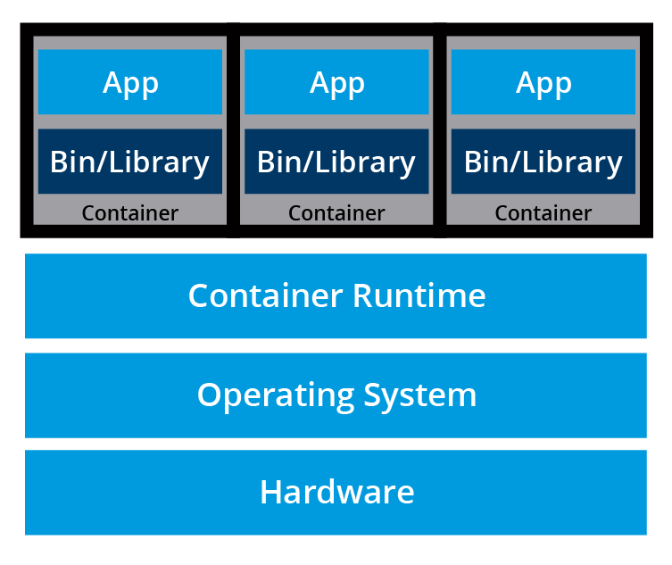

# Container Orchestration

## Chapter Overview

`Container images` allow us to confine the `application code`, its runtime, and all of its dependencies in a pre-defined format. The container runtimes like `runC`, `containerd`, or `cri-o` can use pre-packaged images as a source to create and run one or more containers. These runtimes are capable of running containers on a single host, however, in practice, we would like to have a `fault-tolerant` and `scalable` solution, achieved by building a single `controller/management` unit, a collection of multiple hosts connected together. This controller/management unit is generally referred to as a `container orchestrator`.

In this chapter, we will explore why we should use `container orchestrators`, different implementations of `container orchestrators`, and where to deploy them.

# Container Orchestration

## What Are Containers?

Before we dive into container orchestration, let's review first what containers are.

`Containers` are an application-centric method to deliver high-performing, scalable applications on any infrastructure of your choice. Containers are best suited to deliver microservices by providing portable, isolated virtual environments for applications to run without interference from other running applications.

`Microservices` are lightweight applications written in various modern programming languages, with specific dependencies, libraries and environmental requirements. To ensure that an application has everything it needs to run successfully it is packaged together with its dependencies.

`Containers` encapsulate microservices and their dependencies but do not run them directly. Containers run `container images`.

A `container image` bundles the application along with its runtime, libraries, and dependencies, and it represents the source of a container deployed to offer an isolated executable environment for the application. Containers can be deployed from a specific image on many platforms, such as workstations, Virtual Machines, public cloud, etc.

## What Is Container Orchestration?

In `Development (Dev) environments`, running containers on a single host for development and testing of applications may be a suitable option. However, when migrating to `Quality Assurance (QA)` and `Production (Prod) environments`, that is no longer a viable option because the applications and services need to meet specific requirements:

- `Fault-tolerance`
- `On-demand scalability`
- `Optimal resource usage`
- `Auto-discovery to automatically discover and communicate with each other`
- `Accessibility from the outside world`
- `Seamless updates/rollbacks without any downtime.`

`Container orchestrators `are tools which group systems together to form clusters where containers' deployment and management is automated at scale while meeting the requirements mentioned above. The `clustered systems` confer the advantages of distributed systems, such as increased performance, cost efficiency, reliability, workload distribution, and reduced latency.

## Container Orchestrators

With enterprises containerizing their applications and moving them to the cloud, there is a growing demand for container orchestration solutions. While there are many solutions available, some are mere re-distributions of well-established container orchestration tools, enriched with features and, sometimes, with certain limitations in flexibility.

Although not exhaustive, the list below provides a few different container orchestration tools and services available today:

## Available Container Orchestration Solutions

### [Amazon Elastic Container Service (ECS)](https://aws.amazon.com/ecs/)

Amazon Elastic Container Service (ECS) is a hosted service provided by [Amazon Web Services (AWS)](https://aws.amazon.com/) to run containers at scale on its infrastructure.

### [Azure Container Instances (ACI)](https://azure.microsoft.com/en-us/products/container-instances)

Azure Container Instance (ACI) is a basic container orchestration service provided by [Microsoft Azure](https://azure.microsoft.com/en-us/).

### [Azure Service Fabric](https://azure.microsoft.com/en-us/products/service-fabric/)

Azure Service Fabric is an open source container orchestrator provided by [Microsoft Azure](https://azure.microsoft.com/en-us/).

### [Kubernetes](https://kubernetes.io/)

Kubernetes is an open source orchestration tool, originally started by Google, today part of the [Cloud Native Computing Foundation](https://www.cncf.io/) (CNCF) project.

### [Nomad](https://www.nomadproject.io/)

Nomad is the container and workload orchestrator provided by [HashiCorp](https://www.hashicorp.com/).

### [Docker Swarm](https://docs.docker.com/engine/swarm/)

Docker Swarm is a container orchestrator provided by [Docker, Inc](https://www.docker.com/). It is part of [Docker Engine](https://docs.docker.com/engine/).

> **Note:** Container orchestrators are also explored in another Linux Foundation course, [*"Introduction to Cloud Infrastructure Technologies (LFS151)"*](https://training.linuxfoundation.org/training/introduction-to-cloud-infrastructure-technologies/?_gl=1*1n2vbyu*_gcl_au*MjIzNzk1MzUuMTc1MDM0Nzk4NC4xMTQ5ODE0MDcyLjE3NTA4OTQwNDIuMTc1MDg5NDA0Mg..*_ga*MTIxNDA5NDQwMi4xNzUwMzQ3OTg1*_ga_EMX7DDZMX4*czE3NTE2ODU1MjQkbzExNSRnMSR0MTc1MTY5MjA3NSRqMjAkbDAkaDA.).

## Why Use Container Orchestrators?

Although we can manually maintain a couple of containers or write scripts to manage the lifecycle of dozens of containers, orchestrators make things much easier for users especially when it comes to managing hundreds or thousands of containers running on a global infrastructure.

Most container orchestrators can:

- `Group hosts together` while creating a cluster, in order to leverage the benefits of distributed systems
- `Schedule containers` to run on hosts in the cluster based on resources availability
- `Enable container communication` in a cluster regardless of the host they are deployed to in the cluster
- `Bind containers and storage resources` together
- `Group similar containers` and bind them to load-balancing constructs to simplify access to containerized applications by creating an interface, a level of abstraction between the containers and the client
- `Manage and optimize resource usage`
- `Allow for implementation of policies` to secure access to applications running inside containers

With all these configurable yet flexible features, container orchestrators are an obvious choice when it comes to managing containerized applications at scale. In this course, we will explore `Kubernetes`, one of the most in-demand container orchestration tools available today.

## Where to Deploy Container Orchestrators?

Most container orchestrators can be deployed on the infrastructure of our choice - on bare metal, Virtual Machines, on-premises, on public and hybrid clouds. Kubernetes, for example, can be deployed on:

- A workstation, with or without an isolation layer such as a local hypervisor or container runtime
- Inside a company's data center
- In the cloud on various platforms:
  - AWS Elastic Compute Cloud (EC2) instances
  - Google Compute Engine (GCE) VMs
  - DigitalOcean Droplets
  - IBM Virtual Servers
  - OpenStack
  - And many others

### Managed Kubernetes Services (KaaS)

In addition, there are turnkey cloud solutions which allow production Kubernetes clusters to be installed, with only a few commands, on top of cloud Infrastructures-as-a-Service. These solutions paved the way for the managed container orchestration as-a-Service, more specifically the managed Kubernetes as-a-Service (KaaS) solution, offered and hosted by the major cloud providers.

Examples of KaaS solutions include:

- [Amazon Elastic Kubernetes Service (Amazon EKS)](https://aws.amazon.com/eks/)
- [Azure Kubernetes Service (AKS)](https://azure.microsoft.com/en-us/products/kubernetes-service)
- [DigitalOcean Kubernetes](https://www.digitalocean.com/products/kubernetes)
- [Google Kubernetes Engine (GKE)](https://cloud.google.com/kubernetes-engine/)
- [IBM Cloud Kubernetes Service](https://www.ibm.com/products/kubernetes-service)
- [Oracle Container Engine for Kubernetes](https://www.ibm.com/products/kubernetes-service)
- [VMware Tanzu Kubernetes Grid](https://tanzu.vmware.com/kubernetes-grid)

