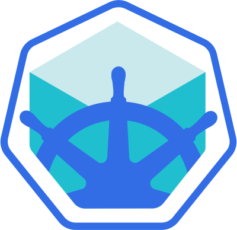

# Minikube: Installing Local Kubernetes Clusters

## Chapter Overview

[Minikube](https://minikube.sigs.k8s.io/) is one of the easiest, most flexible and popular methods to run an all-in-one or a multi-node local Kubernetes cluster, isolated by Virtual Machines (VM) or Containers, run directly on our workstations. Minikube is the tool responsible for the installation of Kubernetes components, cluster bootstrapping, and cluster tear-down when no longer needed. It includes additional features aimed to ease the user interaction with the Kubernetes cluster, but nonetheless, it initializes for us a fully functional, non-production, Kubernetes cluster extremely convenient for learning purposes. Minikube can be installed on native macOS, Windows, and many Linux distributions.

In this chapter, we will explore the requirements to install Minikube locally on our workstation.



## Learning Objectives

By the end of this chapter, you should be able to:

Install Minikube on the native OS of your workstation.
Verify the local installation.

# Minikube: Installing Local Kubernetes Clusters

## What Is Minikube?

Minikube is one of the easiest, most flexible and popular methods to run an all-in-one or a multi-node local Kubernetes cluster directly on our local workstations. It installs and runs on any native OS such as Linux, macOS, or Windows. However, in order to fully take advantage of all the features Minikube has to offer, a [Type-2 Hypervisor](https://en.wikipedia.org/wiki/Hypervisor) or a Container Runtime should be installed on the local workstation, to run in conjunction with Minikube. The role of the hypervisor or container runtime is to offer an isolated infrastructure for the Minikube Kubernetes cluster components, that is easily reproducible, easy to use and tear down. This isolation of the cluster components from our daily environment ensures that once no longer needed, the Minikube components can be safely removed leaving behind no configuration changes to our workstation, thus no traces of their existence. This does not mean, however, that we are responsible for the provisioning of any VMs or containers with guest operating systems with the help of the hypervisor or container runtime. Minikube includes the necessary adapters to interact directly with the isolation software of choice to build all its infrastructure as long as the Type-2 Hypervisor or Container Runtime is installed on our workstation.

Minikube is built on the capabilities of the [libmachine](https://github.com/docker/machine/tree/master/libmachine) library originally designed by Docker to build [Virtual Machine container](https://github.com/docker/machine) hosts on any physical infrastructure. In time Minikube became very flexible, supporting several hypervisors and container runtimes, depending on the host workstation's native OS.

For those who feel more adventurous, Minikube can be installed without an isolation software, on bare-metal, which may result in permanent configuration changes to the host OS. To prevent such permanent configuration changes, a second form of isolation can be achieved by installing Minikube inside a Virtual Machine provisioned with a Type-2 Hypervisor of choice, and a desktop guest OS of choice (with enabled GUI). As a result, when installed inside a VM, Minikube will end up making configuration changes to the guest environment, still isolated from the host workstation. Therefore, now we have two distinct methods to isolate the Minikube environment from our host workstation.

The isolation software can be specified by the user with the --driver option, otherwise Minikube will try to find a preferred method for the host OS of the workstation.

Once decided on the isolation method, the next step is to determine the required number of Kubernetes cluster nodes, and their sizes in terms of CPU, memory, and disk space. Minikube invokes the hypervisor of choice to provision the infrastructure VM(s) which will host the Kubernetes cluster node(s), or the runtime of choice to run infrastructure container(s) that host the cluster node(s). Keep in mind that Minikube now supports all-in-one single-node and multi-node clusters. Regardless of the isolation method and the expected cluster and node sizes, a local Minikube Kubernetes cluster will ultimately be impacted and/or limited by the physical resources of the host workstation. We have to be mindful of the needs of the host OS and any utilities it may be running, then the needs of the hypervisor or the container runtime, and finally the remaining resources that can be allocated to our Kubernetes cluster. For a learning environment the recommendations are that a Kubernetes node has 2 CPU cores (or virtual CPUs) at a minimum, at least 2 GB of RAM memory (with 4 - 8 GB of RAM recommended for optimal usage), and 20+ GB of disk storage space. When migrating towards a larger, more dynamic, production grade cluster, these resource values should be adjusted accordingly. The Kubernetes nodes are expected to access the internet as well, for software updates, container image downloads, and for client accessibility.

Following the node(s)' provisioning phase, Minikube invokes [kubeadm](https://kubernetes.io/docs/setup/production-environment/tools/kubeadm/create-cluster-kubeadm/), to bootstrap the Kubernetes cluster components inside the previously provisioned node(s). We need to ensure that we have the necessary hardware and software required by Minikube to build our environment.

## Requirements for Running Minikube

Here we outline the requirements to run Minikube on our local workstation.

### Requirements

#### VT-x/AMD-v Virtualization

VT-x/AMD-v virtualization may need to be enabled on the local workstation for certain hypervisors.

#### kubectl

[kubectl](https://kubernetes.io/docs/tasks/tools/) command line client (CLI) is a binary used to access and manage any Kubernetes cluster. It is installed through Minikube and accessed through the `minikube kubectl` command, or it can be installed separately and run as a standalone tool. We will explore `kubectl` installation and usage in future chapters.

#### Type-2 Hypervisor or Container Runtime

Without a specified driver, Minikube will try to find an installed hypervisor or a runtime, in the following order of preference (on a Linux host): docker, kvm2, podman, vmware, and virtualbox. If multiple isolation software installations are found, such as docker and virtualbox, Minikube will pick docker over virtualbox if no desired driver is specified by the user. Hypervisors and Container Runtimes supported by various native workstation OSes:

* `On Linux` - [VirtualBox](https://www.virtualbox.org/wiki/Downloads), [KVM2](https://www.linux-kvm.org/page/Main_Page), and [QEMU](https://www.qemu.org/) hypervisors, or [Docker](https://docs.docker.com/engine/install/) and [Podman](https://podman.io/getting-started/installation.html) runtimes.
* `On macOS` - [VirtualBox](https://www.virtualbox.org/wiki/Downloads), [HyperKit](https://github.com/moby/hyperkit), [VMware Fusion](https://podman.io/getting-started/installation.html), [Parallels](https://www.parallels.com/), and [QEMU](https://www.qemu.org/) hypervisors, or [Docker](https://docs.docker.com/desktop/mac/install/) and [Podman](https://podman.io/getting-started/installation.html) runtimes.
* `On Windows` - [VirtualBox](https://www.virtualbox.org/wiki/Downloads), [Hyper-V](https://docs.microsoft.com/en-us/virtualization/hyper-v-on-windows/quick-start/enable-hyper-v), [VMware Workstation](https://www.vmware.com/in/products/workstation-pro/workstation-pro-evaluation.html), and [QEMU](https://www.qemu.org/) hypervisors, or [Docker](https://docs.docker.com/desktop/mac/install/) and [Podman](https://podman.io/getting-started/installation.html) runtimes.

`NOTE:` *Minikube supports a [--driver=none](https://minikube.sigs.k8s.io/docs/drivers/none/)(on Linux) option that runs the Kubernetes components bare-metal, directly on the host OS and not inside a VM. With this option a Docker installation is required and a Linux OS on the local workstation, but no hypervisor installation. `This driver is recommended for advanced users`.*

#### Internet Connection on First Minikube Run

This is needed to download packages, dependencies, updates and pull images needed to initialize the Minikube Kubernetes cluster components. Subsequent Minikube runs will require an Internet connection only when new container images need to be pulled from a public container registry or when deployed containerized applications need it for client accessibility. Once a container image has been pulled, it can be reused from the local container runtime image cache without an Internet connection.

In this chapter, we use one of the most robust and stable isolation methods as a driver, the VirtualBox hypervisor, to provision the VM(s) which host the components of the Kubernetes cluster. While no longer the preferred driver due to slower startup times when compared with other methods, it is still one of the most stable drivers for Minikube on Linux and Windows. However, the VirtualBox hypervisor is no longer compatible with macOS on ARM chipset (M1, M2, and M3), therefore Docker will be used instead.

Read more about Minikube from the official [Minikube documentation](https://minikube.sigs.k8s.io/docs/), the official [Kubernetes documentation](https://kubernetes.io/docs/tasks/tools/#minikube), or [GitHub](https://github.com/kubernetes/minikube).

## Installing Minikube on Linux

Let's learn how to install the latest Minikube release on Ubuntu Linux 22.04 LTS with VirtualBox v7.0 specifically. This installation assumes no other isolation software is installed on our Linux workstation, such as KVM2, QEMU, Docker Engine or Podman, that Minikube can use as a driver.

`NOTE:` `For other Linux OS distributions or releases, VirtualBox and Minikube versions, the installation steps may vary! Check the [Minikube installation](https://kubernetes.io/docs/tasks/tools/install-minikube/) for specific installation instructions!*

### Prerequisites

Verify the virtualization support on your Linux OS in a terminal (a non-empty output indicates supported virtualization):

```bash
grep -E --color 'vmx|svm' /proc/cpuinfo
```

The easiest way to download and install the [VirtualBox](https://www.virtualbox.org/wiki/Linux_Downloads) hypervisor for Linux is from its official download site. VirtualBox is available for many Linux distributions such as Oracle Linux, RHEL, CentOS 7, Ubuntu, Debian, openSUSE, and Fedora.

### Installation Steps

Minikube can be easily downloaded and installed in a terminal. Either the latest release or a specific release available from the [Minikube release page](https://github.com/kubernetes/minikube/releases) can be installed by running the following commands. While these installation commands reflect the official installation guide at the time of this course content update, they may change in the near future as part of the continuous growth of Kubernetes. It is strongly recommended to inspect the [official installation guide](https://minikube.sigs.k8s.io/docs/start/) for `Linux > x86-64 > Stable` when attempting the installation, to ensure the most up-to-date package repositories are used in the process. Below we are presenting the `Binary download` option, a distribution neutral installation approach:

```bash
$ curl -LO \
https://github.com/kubernetes/minikube/releases/latest/download/minikube-linux-amd64

$ sudo install minikube-linux-amd64 /usr/local/bin/minikube && rm minikube-linux-amd64
```

`NOTE:` *Replacing `/latest/` with a particular version, such as `/v1.31.2/` will download that specified Minikube version.*

### Starting Minikube

In a terminal we can start Minikube with the `minikube start` command, which bootstraps a single-node cluster with the latest supported stable Kubernetes version release. For a specific Kubernetes version the `--kubernetes-version` option can be used as such `minikube start --kubernetes-version=v1.27.1` (where latest is default and acceptable version value, and stable is also acceptable). In case there are other virtualization driver candidates for Minikube on the workstation, it is good practice to supply the desired driver with the `--driver=virtualbox` option. More advanced start options will be explored later in this chapter:

```bash
minikube start --driver=virtualbox
```

Example output:

```bash
😄 minikube v1.32.0 on Ubuntu 22.04
✨ Using the virtualbox driver based on user configuration
💿 Downloading VM boot image ...
   > minikube-v1.32.1-amd64.iso....: 65 B / 65 B [---------] 100.00% ? p/s 0s
   > minikube-v1.32.1-amd64.iso: 292.96 MiB / 292.96 MiB 100.00% 31.34 MiB p
👍 Starting control plane node minikube in cluster minikube
💾 Downloading Kubernetes v1.28.3 preload ...
   > preloaded-images-k8s-v18-v1...: 403.35 MiB / 403.35 MiB 100.00% 32.19 M
🔥 Creating virtualbox VM (CPUs=2, Memory=6000MB, Disk=20000MB) ...
🐳 Preparing Kubernetes v1.28.3 on Docker 24.0.7 ...
   ▪ Generating certificates and keys ...
   ▪ Booting up control plane ...
   ▪ Configuring RBAC rules ...
🔗 Configuring bridge CNI (Container Networking Interface) ...
🔎 Verifying Kubernetes components...
   ▪ Using image gcr.io/k8s-minikube/storage-provisioner:v5
🌟 Enabled addons: storage-provisioner, default-storageclass
💡 kubectl not found. If you need it, try: 'minikube kubectl -- get pods -A'
🏄 Done! kubectl is now configured to use "minikube" cluster and "default" namespace by default
```

### Troubleshooting

`NOTE:` *An error message that reads "Unable to pick a default driver..." means that Minikube was not able to locate any one of the supported hypervisors or runtimes. The recommendation is to install or re-install a desired isolation tool, and ensure its executable is found in the default PATH of your OS distribution.*

`NOTE:` *An error message that reads "The vboxdrv kernel module is not loaded" means that a critical VirtualBox kernel module may not be available. First, try to re-install VirtualBox on the workstation. Second, try installing a C compiler that may be missing from your workstation and then build the kernel module. For the Ubuntu 22.04 LTS OS the required gcc compiler can be downloaded and installed from <https://packages.ubuntu.com/jammy/amd64/gcc-12/download>. The kernel module can be built with the `sudo /sbin/vboxconfig` command. After a successful rebuild, attempt to start minikube again with virtualbox using the command above.*

### Basic Minikube Commands

#### Check Status

With the `minikube status` command, we display the status of the Minikube cluster:

```bash
$ minikube status

minikube
type: Control Plane
host: Running
kubelet: Running
apiserver: Running
kubeconfig: Configured
```

#### Stop Minikube

With the `minikube stop` command, we can stop Minikube. This command stops all applications running in Minikube, safely stops the cluster and the VirtualBox VM, preserving our work until we decide to start the Minikube cluster once again, while preserving the Minikube VM:

```bash
$ minikube stop

✋  Stopping node "minikube"  ...
🛑  1 node stopped.
```

When it is time to run the cluster again, simply run the `minikube start` command (driver option is not required), and it will restart the earlier bootstrapped Minikube cluster.

#### Remove Minikube

The `minikube delete` command completely removes Minikube and the Minikube VM. This command should be attempted only when the Minikube cluster is to be decommissioned. All work will be lost after the completion of this command:

```bash
$ minikube delete

🔥 Deleting "minikube" in virtualbox ...
💀 Removed all traces of the "minikube" cluster.
```

# Installing Minikube on macOS

Let's learn how to install the latest Minikube release on macOS with VirtualBox v7.0 or Docker Desktop. This installation assumes no other isolation software is installed on our Mac workstation, such as HyperKit, VMware Fusion, Parallels, or QEMU, that Minikube can use as a driver.

Users of macOS on Intel processors can still use the VirtualBox hypervisor. However, due to lack of ARM architecture support from the latest VirtualBox hypervisor releases, macOS users with M1, M2, and M3 workstations are encouraged to use Docker Desktop instead. While we only need the Docker Engine, the official installation instructions are for the entire Docker Desktop suite.

`NOTE:` *For other hypervisors or container runtimes and Minikube versions the installation steps may vary! Check the Minikube installation for specific installation instructions!*

## Prerequisites

Install[ Docker Desktop for Mac](https://docs.docker.com/desktop/install/mac-install/) from its official download site. Keep in mind that there are distinct installation instructions for the two supported processor architectures - the earlier Intel and the latest `ARM (M1, M2, M3)` respectively. Carefully select the Docker Desktop installation options for your Mac architecture.

## Installation Steps

We can download and install in a terminal the latest release or a specific release from the [Minikube release page](https://github.com/kubernetes/minikube/releases) by running the following commands. While these installation commands reflect the official installation guide at the time of this course content update, they may change in the near future as part of the continuous growth of Kubernetes. It is strongly recommended to inspect the [official installation guide](https://minikube.sigs.k8s.io/docs/start/) for `macOS > x86-64 > Stable and macOS > ARM64 > Stable` respectively when attempting the installation, to ensure the most up-to-date package repositories are used in the process for the target Mac architecture. In addition, inspect the Known Issues section on the `Minikube Docker driver page` for usage tips and recommendations in case of unexpected behaviors of the Docker installation. Below we are presenting the `Binary download` option, a distribution neutral installation approach.

### For Intel (x86-64) Architecture

```bash
$ curl -LO https://github.com/kubernetes/minikube/releases/latest/download/minikube-darwin-amd64

$ sudo install minikube-darwin-amd64 /usr/local/bin/minikube
```

### For ARM64 Architecture (M1, M2, M3)

```bash
$ curl -LO https://github.com/kubernetes/minikube/releases/latest/download/minikube-darwin-arm64

$ sudo install minikube-darwin-arm64 /usr/local/bin/minikube
```

`NOTE:` *Replacing `/latest/` with a particular version, such as `/v1.31.2/` will download that specified version.*

## Starting Minikube

We can start `Minikube` with the `minikube start` command, which bootstraps a single-node cluster with the latest supported stable Kubernetes version release. For a specific Kubernetes version the `--kubernetes-version` option can be used as such `minikube start --kubernetes-version=v1.27.1` (where latest is default and acceptable version value, and stable is also acceptable). In case there are other virtualization driver candidates for `Minikube` on the workstation, it is good practice to supply the desired driver with the `--driver=docker` option. More advanced start options will be explored later in this chapter:

```bash
$ minikube start --driver=docker
```

Example output:
```
😄 minikube v1.32.0 on Darwin 12.3
✨ Using the docker driver based on user configuration
👍 Starting control plane node minikube in cluster minikube
🚜 Pulling base image ...
   > gcr.io/k8s-minikube/kicbase...: 1.62 KiB / 453.90 MiB [>_] 0.00% ? p/s ?
💾 Downloading Kubernetes v1.28.3 preload ...
   > gcr.io/k8s-minikube/kicbase...: 453.90 MiB / 453.90 MiB 100.00% 7.55 Mi
   > preloaded-images-k8s-v18-v1...: 372.28 MiB / 372.28 MiB 100.00% 5.82 Mi
🔥 Creating docker container (CPUs=2, Memory=8000MB) ...
🐳 Preparing Kubernetes v1.28.3 on Docker 24.0.7 ...
   ▪ Generating certificates and keys ...
   ▪ Booting up control plane ...
   ▪ Configuring RBAC rules ...
🔗 Configuring bridge CNI (Container Networking Interface) ...
🔎 Verifying Kubernetes components...
   ▪ Using image gcr.io/k8s-minikube/storage-provisioner:v5
🌟 Enabled addons: storage-provisioner, default-storageclass
💡 kubectl not found. If you need it, try: 'minikube kubectl -- get pods -A'
🏄 Done! kubectl is now configured to use "minikube" cluster and "default" namespace by default
```

## Troubleshooting

`NOTE:` *An error message that reads "Unable to pick a default driver..." means that Minikube was not able to locate any one of the supported hypervisors or runtimes. The recommendation is to re-install a desired isolation tool, and ensure its executable is found in the default PATH of your OS.*

## Basic Minikube Commands

### Check Status

With the `minikube status` command, we display the status of the Minikube cluster:

```bash
$ minikube status

minikube
type: Control Plane
host: Running
kubelet: Running
apiserver: Running
kubeconfig: Configured
```

### Stop Minikube

With the `minikube stop` command, we can stop Minikube. This command stops all applications running in Minikube, safely stops the cluster and the Docker container, preserving our work until we decide to start the Minikube cluster once again, while preserving the Minikube Docker container:

```bash
$ minikube stop

✋  Stopping node "minikube"  ...
🛑  1 nodes stopped.
```

When it is time to run the cluster again, simply run the `minikube start` command (driver option is not required), and it will restart the earlier bootstrapped Minikube cluster.

### Remove Minikube

The `minikube delete` command completely removes Minikube and the Minikube Docker container. This command should be attempted only when the Minikube cluster is to be decommissioned. All work will be lost after the completion of this command:

```bash
$ minikube delete

🔥 Deleting "minikube" in docker ...
💀 Removed all traces of the "minikube" cluster.
```

# Installing Minikube on Windows

Let's learn how to install the latest Minikube release on Windows 10 and 11 with VirtualBox v7.0 specifically. This installation assumes no other isolation software is installed on our Windows workstation, such as Hyper-V, VMware Workstation, QEMU, or Docker Engine, that Minikube can use as a driver.

`NOTE`: *For other OS, VirtualBox, and Minikube versions, the installation steps may vary\! Check the [Minikube installation](https://minikube.sigs.k8s.io/docs/start/) for specific installation instructions\!*

### Verify Virtualization Support

Verify the virtualization support on your Windows system (multiple output lines ending with 'Yes' indicate supported virtualization):

```powershell
PS C:\WINDOWS\system32> systeminfo
```

### Install VirtualBox

Install the [VirtualBox](https://www.virtualbox.org/wiki/Downloads) hypervisor for 'Windows hosts'. Download and install the `.exe` package.

`NOTE`: *You `may` need to disable Hyper-V on your Windows host (if previously installed and used) while running VirtualBox.*

### Install Minikube

We can download the latest release or a specific release available from the [Minikube release page](https://github.com/kubernetes/minikube/releases). Once downloaded, we need to make sure it is added to our `PATH`. There are multiple packages available to download for Windows, found under a Minikube release. However, downloading and installing the `minikube-installer.exe` will automatically add the executable to the `PATH`. Let's download and install the latest `minikube-installer.exe` package.

### Start Minikube

We can start Minikube using the `minikube start` command, which bootstraps a single-node cluster with the latest supported stable Kubernetes version release. For a specific Kubernetes version, the `--kubernetes-version` option can be used as such `minikube start --kubernetes-version=v1.27.1` (where `latest` is default and acceptable version value, and `stable` is also acceptable). In case there are other virtualization driver candidates for Minikube on the workstation, it is good practice to supply the desired driver with the `--driver=virtualbox` option. More advanced start options will be explored later in this chapter. Open PowerShell using the `Run as Administrator` option and execute the following command:

```powershell
PS C:\WINDOWS\system32> minikube start --driver=virtualbox
```

```bash
😄 minikube v1.32.0 on Windows 10
✨ Using the virtualbox driver based on user configuration
💿 Downloading VM boot image ...
    > minikube-v1.32.1-amd64.iso....: 65 B / 65 B [---------] 100.00% ? p/s 0s
    > minikube-v1.32.1-amd64.iso: 292.96 MiB / 292.96 MiB 100.00% 31.34 MiB p
👍 Starting control plane node minikube in cluster minikube
💾 Downloading Kubernetes v1.28.3 preload ...
    > preloaded-images-k8s-v18-v1...: 403.35 MiB / 403.35 MiB 100.00% 32.19 M
🔥 Creating virtualbox VM (CPUs=2, Memory=6000MB, Disk=20000MB) ...
🐳 Preparing Kubernetes v1.28.3 on Docker 24.0.7 ...
    ▪ Generating certificates and keys ...
    ▪ Booting up control plane ...
    ▪ Configuring RBAC rules ...
🔗 Configuring bridge CNI (Container Networking Interface) ...
🔎 Verifying Kubernetes components...
    ▪ Using image gcr.io/k8s-minikube/storage-provisioner:v5
🌟 Enabled addons: storage-provisioner, default-storageclass
💡 kubectl not found. If you need it, try: 'minikube kubectl -- get pods -A'
🏄 Done! kubectl is now configured to use "minikube" cluster and "default" namespace by default
```

`NOTE`: *An error message that reads "Unable to pick a default driver..." means that Minikube was not able to locate any one of the supported hypervisors or runtimes. The recommendation is to install or re-install a desired isolation tool, and ensure its executable is found in the default `PATH` of your OS.*

### Check the Status

With the `minikube status` command, we display the status of the Minikube cluster. Open PowerShell using the `Run as Administrator` option and execute the following command:

```bash
PS C:\WINDOWS\system32> minikube status
```

```bash
minikube
type: Control Plane
host: Running
kubelet: Running
apiserver: Running
kubeconfig: Configured
```

### Stop Minikube

We can stop Minikube using the `minikube stop` command. This command stops all applications running in Minikube, safely stops the cluster and the VirtualBox VM, preserving our work until we decide to start the Minikube cluster once again, while preserving the Minikube VM. Open PowerShell using the `Run as Administrator` option and execute the following command:

```bash
PS C:\WINDOWS\system32> minikube stop
```

```bash
✋   Stopping node "minikube"  ...
🛑   1 nodes stopped.
```

When it is time to run the cluster again, simply run the `minikube start` command (driver option is not required), and it will restart the earlier bootstrapped Minikube cluster.

### Remove Minikube

The `minikube delete` command completely removes Minikube and the Minikube VM. This command should be attempted only when the Minikube cluster is to be decommissioned. All work will be lost after the completion of this command. Open PowerShell using the `Run as Administrator` option and execute the following command:

```bash
PS C:\WINDOWS\system32> minikube delete
```

```bash
🔥 Deleting "minikube" in virtualbox ...
💀 Removed all traces of the "minikube" cluster.
```

# Advanced Minikube Features

Now that we have familiarized ourselves with the default `minikube start` command, let's dive deeper into Minikube to understand some of its more advanced features.

The `minikube start` by default selects a driver isolation software, such as a hypervisor or a container runtime, if one (VirtualBox) or multiple are installed on the host workstation. In addition, it downloads the latest Kubernetes version components. With the selected driver software, it provisions a single VM named `minikube` (with hardware profile of CPUs=2, Memory=6GB, Disk=20GB) or container (Docker) to host the default single-node all-in-one Kubernetes cluster. Once the node is provisioned, it bootstraps the Kubernetes control plane (with the default `kubeadm` tool), and it installs the latest version of the default container runtime, Docker, that will serve as a running environment for the containerized applications we will deploy to the Kubernetes cluster. The `minikube start` command generates a default minikube cluster with the specifications described above and it will store these specs so that we can restart the default cluster whenever desired. The object that stores the specifications of our cluster is called a **profile**.

As Minikube matures, so do its features and capabilities. With the introduction of profiles, Minikube allows users to create custom reusable clusters that can all be managed from a single command line client.

## Minikube Profiles

The `minikube profile` command allows us to view the status of all our clusters in a table formatted output. Assuming we have created only the default minikube cluster, we could list the properties that define the default profile with:

```bash
$ minikube profile list
```

```bash
|----------|------------|---------|----------------|------|---------|---------|-------|--------|
| Profile  | VM Driver  | Runtime |      IP        | Port | Version | Status  | Nodes | Active |
|----------|------------|---------|----------------|------|---------|---------|-------|--------|
| minikube | virtualbox | docker  | 192.168.59.100 | 8443 | v1.28.3 | Running |     1 | * |
|----------|------------|---------|----------------|------|---------|---------|-------|--------|
```

This table presents the columns associated with the default properties such as the profile name: `minikube`, the isolation driver: `VirtualBox`, the container runtime: `Docker`, the Kubernetes version: `v1.28.3`, the status of the cluster - running or stopped. The table also displays the number of nodes: 1 by default, the private IP address of the minikube cluster's control plane VirtualBox VM, and the secure port that exposes the API Server to cluster control plane components, agents and clients: `8443`.

What if we desire to create several reusable clusters instead, with other drivers (Docker or Podman - still experimental on Linux) for node isolation, or different Kubernetes versions (v1.27.10 or v1.28.1), another runtime (cri-o or containerd), and possibly 2, 3, or more nodes (if permitted by the resources of our host system)? What if we desire to further customize the cluster with a specific networking option or plugin? The `minikube start` command allows us to create such custom profiles with the `--profile` or `-p` flags. Several of the isolation drivers support creation of node VMs or node containers of custom sizes as well, features that we will not explore in this course as not all are very stable at the time of this writing.

Below are a few examples of more complex `start` commands that allow custom clusters to be created with Minikube. They assume that the desired driver software (Docker and/or Podman) has been installed on the host workstation. There is no need to download the desired CNI (network plugin) or the container runtime, they will be set up and enabled by Minikube on our behalf:

```bash
$ minikube start --kubernetes-version=v1.27.10 \
  --driver=podman --profile minipod
$ minikube start --nodes=2 --kubernetes-version=v1.28.1 \
  --driver=docker --profile doubledocker
$ minikube start --driver=virtualbox --nodes=3 --disk-size=10g \
  --cpus=2 --memory=6g --kubernetes-version=v1.27.12 --cni=calico \
  --container-runtime=cri-o -p multivbox
$ minikube start --driver=docker --cpus=6 --memory=8g \
  --kubernetes-version="1.27.12" -p largedock
$ minikube start --driver=virtualbox -n 3 --container-runtime=containerd \
  --cni=calico -p minibox
```

Once multiple cluster profiles are available (the default `minikube` and custom `minibox`), the profiles table will look like this:

```bash
$ minikube profile list
```

```bash
|----------|------------|---------|----------------|------|---------|---------|-------|--------|
| Profile  | VM Driver  | Runtime |      IP        | Port | Version | Status  | Nodes | Active |
|----------|------------|---------|----------------|------|---------|---------|-------|--------|
| minibox  | virtualbox | crio    | 192.168.59.101 | 8443 | v1.25.3 | Running |     3 |        |
| minikube | virtualbox | docker  | 192.168.59.100 | 8443 | v1.25.3 | Running |     1 | * |
|----------|------------|---------|----------------|------|---------|---------|-------|--------|
```

The `active` marker indicates the target cluster profile of the minikube command line tool, also known as its context. The target cluster can be set to `minibox` with the following command:

```bash
$ minikube profile minibox
```

The target cluster can be set to the default `minikube` with one of the following commands:

```bash
$ minikube profile minikube
$ minikube profile default
```

## Profile-Aware Commands

Most `minikube` commands, such as `start`, `stop`, `node`, etc., are profile aware, meaning that the user is required to explicitly specify the target cluster of the command, through its profile name. The default `minikube` cluster, however, can be managed implicitly without specifying its profile name. Stopping and re-starting the two clusters listed above, the `minibox` cluster (explicitly) and the default `minikube` cluster (implicitly):

```bash
$ minikube stop -p minibox
$ minikube start -p minibox
$ minikube stop
$ minikube start
```

## Additional Helpful Minikube Commands

### Display Minikube Version

To display the version of the current Minikube installation:

```bash
$ minikube version
```

```bash
minikube version: v1.32.0
commit: 8220a6eb95f0a4d75f7f2d7b14cef975f050512d
```

### Enable Shell Completion

Completion is a helpful post-installation configuration to enable the `minikube` command to respond to typical auto-completion mechanisms, such as completing a command in the terminal by pressing the TAB key. To enable completion for the bash shell on Ubuntu:

```bash
$ sudo apt install bash-completion
$ source /etc/bash_completion
$ source <(minikube completion bash)
```

If needed, also run the following command:

```bash
$ minikube completion bash
```

### Manage Cluster Nodes

A command that allows users to list the nodes of a cluster, add new control plane or worker nodes, delete existing cluster nodes, start or stop individual nodes of a cluster:

```bash
$ minikube node list
```

```
minikube 192.168.59.100
```

```bash
$ minikube node list -p minibox
```

```
minibox       192.168.59.101
minibox-m02   192.168.59.102
minibox-m03   192.168.59.103
```

### Display Node IP Address

To display the cluster control plane node's IP address, or another node's IP with the `--node` or `-n` flags:

```bash
$ minikube ip
```

```
192.168.59.100
```

```bash
$ minikube -p minibox ip
```

```
192.168.59.101
```

```bash
$ minikube -p minibox ip -n minibox-m02
```

```
192.168.59.102
```

### Delete a Cluster Profile

When a cluster configuration is no longer of use, the cluster's profile can be deleted. It is also a profile aware command - it deletes the default `minikube` cluster if no profile is specified, or a custom cluster if its profile is specified:

```bash
$ minikube delete
```

```
🔥  Deleting "minikube" in virtualbox ...
💀  Removed all traces of the "minikube" cluster.
```

```bash
$ minikube delete -p minibox
```

```
🔥  Deleting "minibox" in virtualbox ...
🔥  Deleting "minibox-m02" in virtualbox ...
🔥  Deleting "minibox-m03" in virtualbox ...
💀  Removed all traces of the "minibox" cluster.
```

For additional commands and usage options please visit the [Minikube command line reference](https://minikube.sigs.k8s.io/docs/commands/).# Advanced Minikube Features

Now that we have familiarized ourselves with the default `minikube start` command, let's dive deeper into Minikube to understand some of its more advanced features.

The `minikube start` by default selects a driver isolation software, such as a hypervisor or a container runtime, if one (VirtualBox) or multiple are installed on the host workstation. In addition, it downloads the latest Kubernetes version components. With the selected driver software, it provisions a single VM named `minikube` (with hardware profile of CPUs=2, Memory=6GB, Disk=20GB) or container (Docker) to host the default single-node all-in-one Kubernetes cluster. Once the node is provisioned, it bootstraps the Kubernetes control plane (with the default `kubeadm` tool), and it installs the latest version of the default container runtime, Docker, that will serve as a running environment for the containerized applications we will deploy to the Kubernetes cluster. The `minikube start` command generates a default minikube cluster with the specifications described above and it will store these specs so that we can restart the default cluster whenever desired. The object that stores the specifications of our cluster is called a **profile**.

As Minikube matures, so do its features and capabilities. With the introduction of profiles, Minikube allows users to create custom reusable clusters that can all be managed from a single command line client.

## Minikube Profiles

The `minikube profile` command allows us to view the status of all our clusters in a table formatted output. Assuming we have created only the default minikube cluster, we could list the properties that define the default profile with:

```bash
$ minikube profile list
```

```
|----------|------------|---------|----------------|------|---------|---------|-------|--------|
| Profile  | VM Driver  | Runtime |      IP        | Port | Version | Status  | Nodes | Active |
|----------|------------|---------|----------------|------|---------|---------|-------|--------|
| minikube | virtualbox | docker  | 192.168.59.100 | 8443 | v1.28.3 | Running |     1 | * |
|----------|------------|---------|----------------|------|---------|---------|-------|--------|
```

This table presents the columns associated with the default properties such as the profile name: `minikube`, the isolation driver: `VirtualBox`, the container runtime: `Docker`, the Kubernetes version: `v1.28.3`, the status of the cluster - running or stopped. The table also displays the number of nodes: 1 by default, the private IP address of the minikube cluster's control plane VirtualBox VM, and the secure port that exposes the API Server to cluster control plane components, agents and clients: `8443`.

What if we desire to create several reusable clusters instead, with other drivers (Docker or Podman - still experimental on Linux) for node isolation, or different Kubernetes versions (v1.27.10 or v1.28.1), another runtime (cri-o or containerd), and possibly 2, 3, or more nodes (if permitted by the resources of our host system)? What if we desire to further customize the cluster with a specific networking option or plugin? The `minikube start` command allows us to create such custom profiles with the `--profile` or `-p` flags. Several of the isolation drivers support creation of node VMs or node containers of custom sizes as well, features that we will not explore in this course as not all are very stable at the time of this writing.

Below are a few examples of more complex `start` commands that allow custom clusters to be created with Minikube. They assume that the desired driver software (Docker and/or Podman) has been installed on the host workstation. There is no need to download the desired CNI (network plugin) or the container runtime, they will be set up and enabled by Minikube on our behalf:

```bash
$ minikube start --kubernetes-version=v1.27.10 \
  --driver=podman --profile minipod
$ minikube start --nodes=2 --kubernetes-version=v1.28.1 \
  --driver=docker --profile doubledocker
$ minikube start --driver=virtualbox --nodes=3 --disk-size=10g \
  --cpus=2 --memory=6g --kubernetes-version=v1.27.12 --cni=calico \
  --container-runtime=cri-o -p multivbox
$ minikube start --driver=docker --cpus=6 --memory=8g \
  --kubernetes-version="1.27.12" -p largedock
$ minikube start --driver=virtualbox -n 3 --container-runtime=containerd \
  --cni=calico -p minibox
```

Once multiple cluster profiles are available (the default `minikube` and custom `minibox`), the profiles table will look like this:

```bash
$ minikube profile list
```

```
|----------|------------|---------|----------------|------|---------|---------|-------|--------|
| Profile  | VM Driver  | Runtime |      IP        | Port | Version | Status  | Nodes | Active |
|----------|------------|---------|----------------|------|---------|---------|-------|--------|
| minibox  | virtualbox | crio    | 192.168.59.101 | 8443 | v1.25.3 | Running |     3 |        |
| minikube | virtualbox | docker  | 192.168.59.100 | 8443 | v1.25.3 | Running |     1 | * |
|----------|------------|---------|----------------|------|---------|---------|-------|--------|
```

The `active` marker indicates the target cluster profile of the minikube command line tool, also known as its context. The target cluster can be set to `minibox` with the following command:

```bash
$ minikube profile minibox
```

The target cluster can be set to the default `minikube` with one of the following commands:

```bash
$ minikube profile minikube
$ minikube profile default
```

## Profile-Aware Commands

Most `minikube` commands, such as `start`, `stop`, `node`, etc., are profile aware, meaning that the user is required to explicitly specify the target cluster of the command, through its profile name. The default `minikube` cluster, however, can be managed implicitly without specifying its profile name. Stopping and re-starting the two clusters listed above, the `minibox` cluster (explicitly) and the default `minikube` cluster (implicitly):

```bash
$ minikube stop -p minibox
$ minikube start -p minibox
$ minikube stop
$ minikube start
```

## Additional Helpful Minikube Commands

### Display Minikube Version

To display the version of the current Minikube installation:

```bash
$ minikube version
```

```
minikube version: v1.32.0
commit: 8220a6eb95f0a4d75f7f2d7b14cef975f050512d
```

### Enable Shell Completion

Completion is a helpful post-installation configuration to enable the `minikube` command to respond to typical auto-completion mechanisms, such as completing a command in the terminal by pressing the TAB key. To enable completion for the bash shell on Ubuntu:

```bash
$ sudo apt install bash-completion
$ source /etc/bash_completion
$ source <(minikube completion bash)
```

If needed, also run the following command:

```bash
$ minikube completion bash
```

### Manage Cluster Nodes

A command that allows users to list the nodes of a cluster, add new control plane or worker nodes, delete existing cluster nodes, start or stop individual nodes of a cluster:

```bash
$ minikube node list
```

```
minikube 192.168.59.100
```

```bash
$ minikube node list -p minibox
```

```
minibox       192.168.59.101
minibox-m02   192.168.59.102
minibox-m03   192.168.59.103
```

### Display Node IP Address

To display the cluster control plane node's IP address, or another node's IP with the `--node` or `-n` flags:

```bash
$ minikube ip
```

```
192.168.59.100
```

```bash
$ minikube -p minibox ip
```

```
192.168.59.101
```

```bash
$ minikube -p minibox ip -n minibox-m02
```

```
192.168.59.102
```

### Delete a Cluster Profile

When a cluster configuration is no longer of use, the cluster's profile can be deleted. It is also a profile aware command - it deletes the default `minikube` cluster if no profile is specified, or a custom cluster if its profile is specified:

```bash
$ minikube delete
```

```
🔥  Deleting "minikube" in virtualbox ...
💀  Removed all traces of the "minikube" cluster.
```

```bash
$ minikube delete -p minibox
```

```
🔥  Deleting "minibox" in virtualbox ...
🔥  Deleting "minibox-m02" in virtualbox ...
🔥  Deleting "minibox-m03" in virtualbox ...
💀  Removed all traces of the "minibox" cluster.
```

For additional commands and usage options please visit the [Minikube command line reference](https://minikube.sigs.k8s.io/docs/commands/).