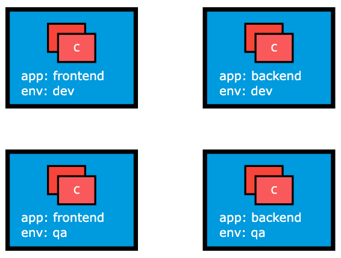
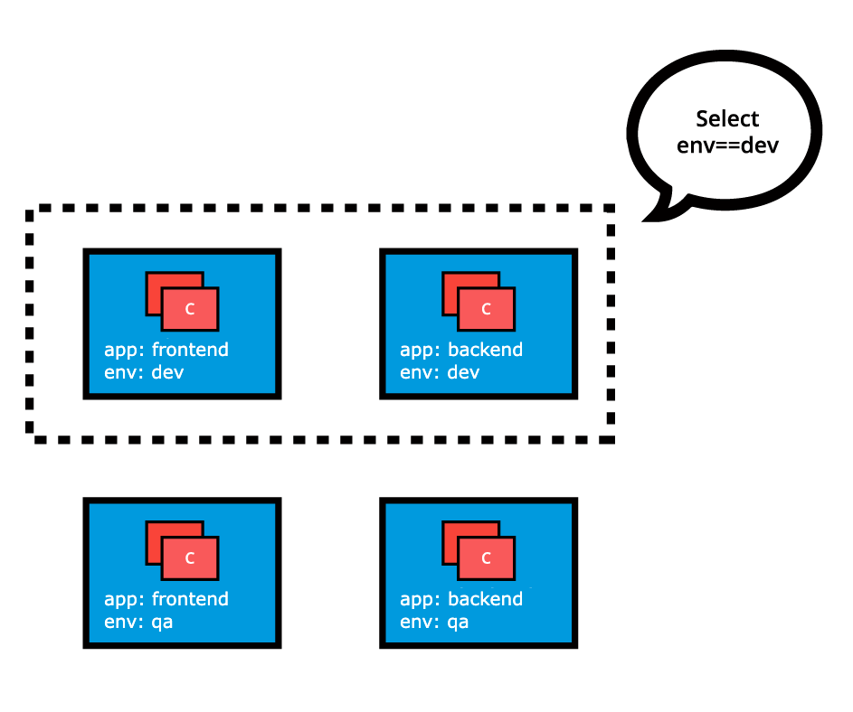
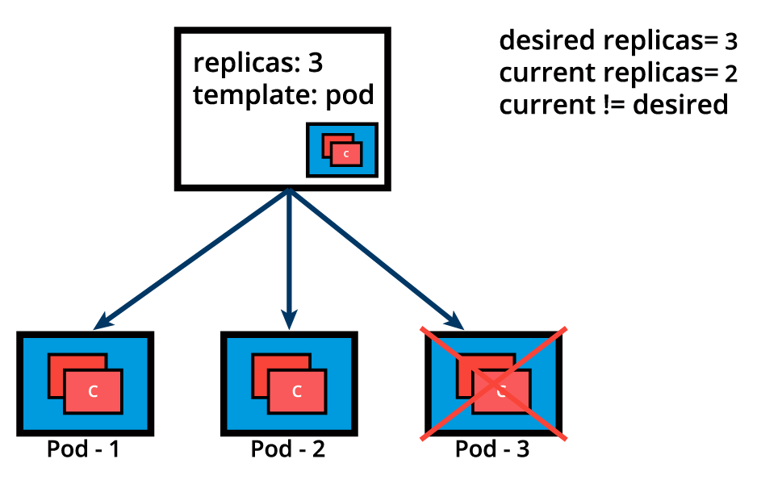
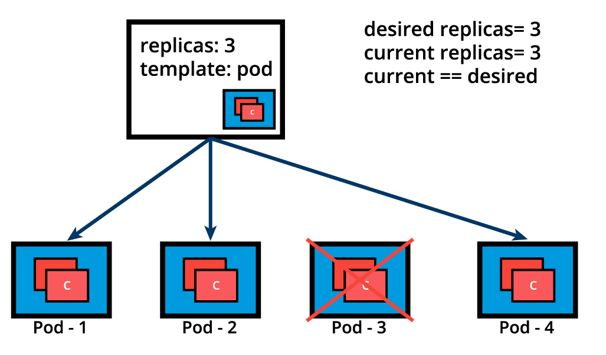
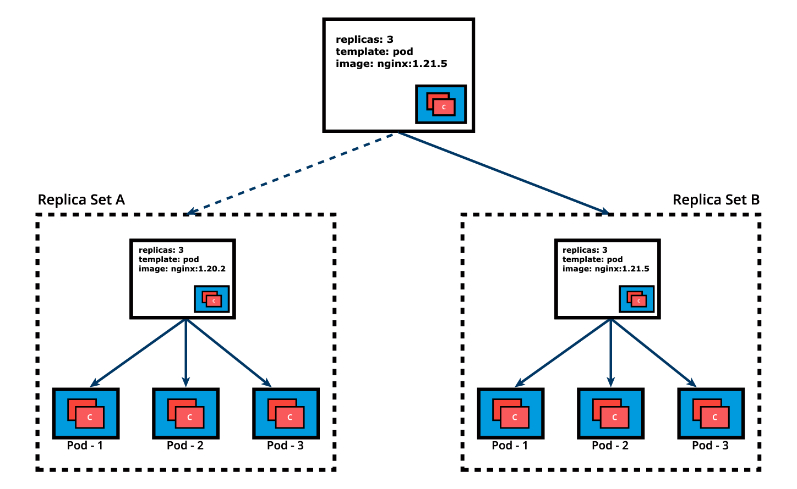
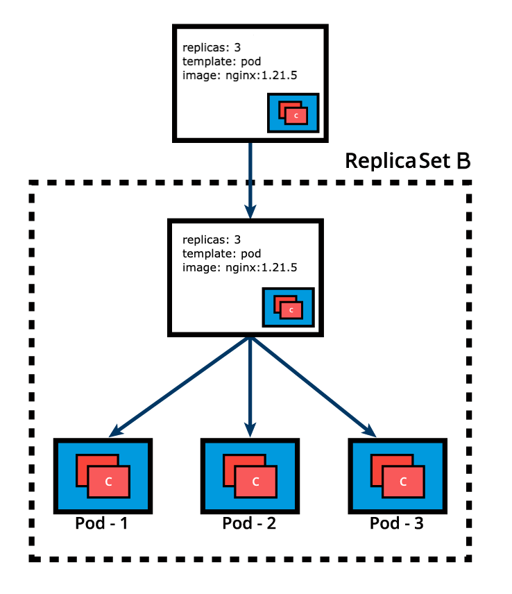

# Kubernetes Building Blocks

## Chapter Overview

In this chapter, we will explore the Kubernetes object model and describe some of its fundamental building blocks, such as Nodes, Namespaces, Pods, ReplicaSets, Deployments, DaemonSets, etc. We will also discuss the essential role of Labels and Selectors in a microservices-driven architecture as they logically group decoupled objects together.

## Learning Objectives

By the end of this chapter, you should be able to:

- Describe the Kubernetes object model.
- Discuss Kubernetes building blocks, e.g. Nodes,Namespaces, Pods, ReplicaSets, Deployments, DaemonSets.
- Discuss Labels and Selectors.

# Kubernetes Building Blocks

## Kubernetes Object Model

Kubernetes became popular due to its advanced application lifecycle management capabilities, implemented through a rich object model, representing different persistent entities in the Kubernetes cluster. Those entities describe:

- What containerized applications we are running.
- The nodes where the containerized applications are deployed.
- Application resource consumption.
- Policies attached to applications, like restart/upgrade policies, fault tolerance, ingress/egress, access control, etc.

With each object, we declare our intent, or the desired state of the object, in the `spec` section. The Kubernetes system manages the `status` section for objects, where it records the actual state of the object. At any given point in time, the Kubernetes Control Plane tries to match the object's actual state to the object's desired state. An object definition manifest must include other fields that specify the version of the API we are referencing as the `apiVersion`, the object type as `kind`, and additional data helpful to the cluster or users for accounting purposes - the `metadata`. In certain object definitions, however, we find different sections that replace `spec`, they are `data` and `stringData`. Both `data` and `stringData` sections facilitate the declaration of information that should be stored by their respective objects.

Examples of Kubernetes object types are `Nodes`, `Namespaces`, `Pods`, `ReplicaSets Deployments`, `DaemonSets`, etc. We will explore them next.

When creating an object, the object's configuration data section from below the `spec` field has to be submitted to the Kubernetes API Server. The API request to create an object must have the `spec` section, describing the desired state, as well as other details. Although the API Server accepts object definitions in a JSON format, most often we provide such definition manifests in a YAML format which is converted by `kubectl` in a JSON payload and sent to the API Server.

## Nodes

[Nodes](https://kubernetes.io/docs/concepts/architecture/nodes/) are virtual identities assigned by Kubernetes to the systems part of the cluster - whether Virtual Machines, bare-metal, Containers, etc. These identities are unique to each system, and are used by the cluster for resources accounting and monitoring purposes, which helps with workload management throughout the cluster.

Each node is managed with the help of two Kubernetes node agents - `kubelet` and `kube-proxy`, while it also hosts a container runtime. The container runtime is required to run all containerized workload on the node - control plane agents and user workloads. The `kubelet` and `kube-proxy` node agents are responsible for executing all local workload management related tasks - interact with the runtime to run containers, monitor containers and node health, report any issues and node state to the API Server, and manage network traffic to containers.

Based on their predetermined functions, there are two distinct types of nodes - control plane and worker. A typical Kubernetes cluster includes at least one control plane node, but it may include multiple control plane nodes for the `High Availability (HA)` of the control plane. In addition, the cluster includes one or more worker nodes to provide resource redundancy in the cluster. There are cases when a single all-in-one cluster is bootstrapped as a single node on a single VM, bare-metal, or Container, when high availability and resource redundancy are not of importance. These are hybrid or mixed nodes hosting both control plane agents and user workload on the same system. Minikube allows us to bootstrap multi-node clusters with distinct, dedicated control plane nodes, however, if our host system has a limited amount of physical resources (CPU, RAM, disk), we can easily bootstrap a single all-in-one cluster as a single node on a single VM or Container, and still be able to explore most of the topics covered in this course, with the exception of features specific to multi-node clusters, such as DaemonSets, multi node networking, etc.

Node identities are created and assigned during the cluster bootstrapping process by the tool responsible to initialize the cluster agents. Minikube is using the default `kubeadm` bootstrapping tool, to initialize the control plane node during the init phase and grow the cluster by adding worker or control plane nodes with the join phase.

The control plane nodes run the control plane agents, such as the API Server, Scheduler, Controller Managers, and etcd in addition to the `kubelet` and kube-proxy node agents, the container runtime, and add-ons for container networking, monitoring, logging, DNS, etc.

Worker nodes run the `kubelet` and kube-proxy node agents, the container runtime, and add-ons for container networking, monitoring, logging, DNS, etc.

Collectively, the control plane node(s) and the worker node(s) represent the Kubernetes cluster. A cluster’s nodes are systems distributed either on the same private network, across different networks, even across different cloud networks.

## Namespaces

If multiple users and teams use the same Kubernetes cluster we can partition the cluster into virtual sub-clusters using `Namespaces`. The names of the resources/objects created inside a Namespace are unique, but not across Namespaces in the cluster.

To list all the Namespaces, we can run the following command:

```bash
$ kubectl get namespaces
```

```bash
NAME              STATUS   AGE
default           Active   11h
kube-node-lease   Active   11h
kube-public       Active   11h
kube-system       Active   11h
```

Generally, Kubernetes creates four Namespaces out of the box: `kube-system`, `kube-public`, `kube-node-lease`, and `default`. The `kube-system` Namespace contains the objects created by the Kubernetes system, mostly the control plane agents. The `default` Namespace contains the objects and resources created by administrators and developers, and objects are assigned to it by default unless another Namespace name is provided by the user. `kube-public` is a special Namespace, which is unsecured and readable by anyone, used for special purposes such as exposing public (non-sensitive) information about the cluster. The newest Namespace is `kube-node-lease` which holds node lease objects used for node heartbeat data. Good practice, however, is to create additional Namespaces, as desired, to virtualize the cluster and isolate users, developer teams, applications, or tiers:

```bash
$ kubectl create namespace new-namespace-name
```

Namespaces are one of the most desired features of Kubernetes, securing its lead against competitors, as it provides a solution to the multi-tenancy requirement of today's enterprise development teams.

[`Resource quotas`](https://kubernetes.io/docs/concepts/policy/resource-quotas/) help users limit the overall resources consumed within Namespaces, while [`LimitRanges`](https://kubernetes.io/docs/concepts/policy/limit-range/) help limit the resources consumed by individual Containers and their enclosing objects in a Namespace. We will briefly cover quota management in a later chapter.

## Pods

A `Pod` is the smallest Kubernetes workload object. It is the unit of deployment in Kubernetes, which represents a single instance of the application. A Pod is a logical collection of one or more containers, enclosing and isolating them to ensure that they:

- Are scheduled together on the same host with the Pod.
- Share the same network namespace, meaning that they share a single IP address originally assigned to the Pod.
- Have access to mount the same external storage (volumes) and other common dependencies.


Pods are ephemeral in nature, and they do not have the capability to self-heal themselves. That is the reason they are used with controllers, or operators (controllers/operators are used interchangeably), which handle Pods' replication, fault tolerance, self-healing, etc. Examples of controllers are Deployments, ReplicaSets, DaemonSets, Jobs, etc. When an operator is used to manage an application, the Pod's specification is nested in the controller's definition using the Pod Template.

Below is an example of a stand-alone Pod object's definition manifest in `YAML` format, without an operator. This represents the declarative method to define an object, and can serve as a template for a much more complex Pod definition manifest if desired:

```yaml
apiVersion: v1
kind: Pod
metadata:
  name: nginx-pod
  labels:
    run: nginx-pod
spec:
  containers:
  - name: nginx-pod
    image: nginx:1.22.1
    ports:
    - containerPort: 80
```

The `apiVersion` field must specify `v1` for the Pod object definition. The second required field is `kind` specifying the `Pod` object type. The third required field `metadata`, holds the object's name and optional labels and annotations. The fourth required field `spec` marks the beginning of the block defining the desired state of the Pod object - also named the `PodSpec`. Our Pod creates a single container running the `nginx:1.22.1` image pulled from a container image registry, in this case from [Docker Hub](https://hub.docker.com/_/nginx). The `containerPort` field specifies the container port to be exposed by Kubernetes resources for inter-application access or external client access - to be explored in the Services chapter. The contents of `spec` are evaluated for scheduling purposes, then the `kubelet` of the selected node becomes responsible for running the container image with the help of the container runtime of the node. The Pod's name and labels are used for workload accounting purposes.

The above definition manifest, if stored by a `def-pod.yaml` file, is loaded into the cluster to run the desired Pod and its associated container image. While `create` is exemplified below, advanced Kubernetes practitioners may opt to use `apply` instead:

```bash
$ kubectl create -f def-pod.yaml
```

Writing up definition manifests, especially complex ones, may prove to be quite time consuming and troublesome because YAML is extremely sensitive to indentation. When eventually editing such definition manifests keep in mind that each indent is two blank spaces wide, and TAB should be omitted.

Imperatively, we can simply run the Pod defined above without the definition manifest as such:

```bash
$ kubectl run nginx-pod --image=nginx:1.22.1 --port=80
```

However, when in need of a starter definition manifest, knowing how to generate one can be a life-saver. The imperative command with additional key flags such as `dry-run` and the `yaml` output, can generate the definition template instead of running the Pod, while the template is then stored in the `nginx-pod.yaml` file. The following is a multi-line command that should be selected in its entirety for copy/paste (including the backslash character ""):

```bash
$ kubectl run nginx-pod --image=nginx:1.22.1 --port=80 \
--dry-run=client -o yaml > nginx-pod.yaml
```

The command above generates a definition manifest in YAML, but we can generate a JSON definition file just as easily with:

```bash
$ kubectl run nginx-pod --image=nginx:1.22.1 --port=80 \
--dry-run=client -o json > nginx-pod.json
```

Both the YAML and JSON definition files can serve as templates or can be loaded into the cluster respectively as such:

```bash
$ kubectl create -f nginx-pod.yaml
$ kubectl create -f nginx-pod.json
```

Before advancing to more complex application deployment and management methods, become familiar with Pod operations with additional commands such as:

```bash
$ kubectl apply -f nginx-pod.yaml
$ kubectl get pods
$ kubectl get pod nginx-pod -o yaml
$ kubectl get pod nginx-pod -o json
$ kubectl describe pod nginx-pod
$ kubectl delete pod nginx-pod
```

#3 Labels

[`Labels`](https://kubernetes.io/docs/concepts/overview/working-with-objects/labels/) are key-value pairs attached to Kubernetes objects such as `Pods`, `ReplicaSets`, `Nodes`, `Namespaces` and `Persistent Volumes`. Labels are used to organize and select a subset of objects, based on the requirements in place. Many objects can have the same Label(s). Labels do not provide uniqueness to objects. Controllers use Labels to logically group together decoupled objects, rather than using objects' names or IDs.



In the image above, we have used two Label keys: `app` and `env`. Based on our requirements, we have given different values to our four Pods. The Label `env=dev` logically selects and groups the top two Pods, while the Label `app=frontend` logically selects and groups the left two Pods. We can select one of the four Pods - bottom left, by selecting two Labels: `app=frontend` AND `env=qa`.

## Label Selectors

Controllers, or operators, and Services, use [`label selectors`](https://kubernetes.io/docs/concepts/overview/working-with-objects/labels/#label-selectors) to select a subset of objects. Kubernetes supports two types of Selectors:

## Equality-Based Selectors

Equality-Based Selectors allow filtering of objects based on Label keys and values. Matching is achieved using the `=` or `==` (equals, used interchangeably), or `!=` (not equals) operators. For example, with `env==dev` or `env=dev` we are selecting the objects where the `env` Label key is set to value `dev`.

## Set-Based Selectors

Set-Based Selectors allow filtering of objects based on a set of values. We can use `in`, `notin` operators for Label values, and `exist`/`does not exist` operators for Label keys. For example, with `env in (dev,qa)` we are selecting objects where the `env` Label is set to either `dev` or `qa` with `!app` we select objects with no Label key `app`.



## ReplicationControllers

Although no longer a recommended controller, a [`ReplicationController`](https://kubernetes.io/docs/concepts/workloads/controllers/replicationcontroller/) is a complex operator that ensures a specified number of replicas of a Pod are running at any given time the desired version of the application container, by constantly comparing the actual state with the desired state of the managed application. If there are more Pods than the desired count, the replication controller randomly terminates the number of Pods exceeding the desired count, and, if there are fewer Pods than the desired count, then the replication controller requests additional Pods to be created until the actual count matches the desired count. Generally, we do not deploy a Pod independently, as it would not be able to restart itself if terminated in error because a Pod misses the much desired self-healing feature that Kubernetes otherwise promises. The recommended method is to use some type of an operator to run and manage Pods.

In addition to replication, the ReplicationController operator also supports application updates.

The default recommended controller is the [`Deployment`](https://kubernetes.io/docs/concepts/workloads/controllers/deployment/) which configures a [`ReplicaSet`](https://kubernetes.io/docs/concepts/workloads/controllers/replicaset/) controller to manage application Pods' lifecycle.

# ReplicaSets

A [`ReplicaSet`](https://kubernetes.io/docs/concepts/workloads/controllers/replicaset/) is, in part, the next-generation ReplicationController, as it implements the replication and self-healing aspects of the ReplicationController. ReplicaSets support both equality- and set-based Selectors, whereas ReplicationControllers only support equality-based Selectors.

When a single instance of an application is running there is always the risk of the application instance crashing unexpectedly, or the entire server hosting the application crashing. If relying only on a single application instance, such a crash could adversely impact other applications, services, or clients. To avoid such possible failures, we can run in parallel multiple instances of the application, hence achieving high availability. The lifecycle of the application defined by a Pod will be overseen by a controller - the ReplicaSet. With the help of the ReplicaSet, we can scale the number of Pods running a specific application container image. Scaling can be accomplished manually or through the use of an [`autoscaler`](https://kubernetes.io/docs/tasks/run-application/horizontal-pod-autoscale/).

Below we graphically represent a ReplicaSet, with the replica count set to 3 for a specific Pod template. Pod-1, Pod-2, and Pod-3 are identical, running the same application container image, being cloned from the same Pod template. For now, the current state matches the desired state. Keep in mind, however, that although the three Pod replicas are said to be identical - running an instance of the same application, same configuration, they are still distinct through unique Pod name and IP address. The Pod object ensures that the application can be individually placed on any worker node of the cluster as a result of the scheduling process.


## ReplicaSet (Current State Matches the Desired State)

Below is an example of a ReplicaSet object's definition manifest in YAML format. This represents the declarative method to define an object, and can serve as a template for a much more complex ReplicaSet definition manifest if desired:

```yaml
apiVersion: apps/v1
kind: ReplicaSet
metadata:
  name: frontend
  labels:
    app: guestbook
    tier: frontend
spec:
  replicas: 3
  selector:
    matchLabels:
      app: guestbook
  template:
    metadata:
      labels:
        app: guestbook
    spec:
      containers:
      - name: php-redis
        image: gcr.io/google_samples/gb-frontend:v3
```

The above definition manifest, if stored by a `redis-rs.yaml` file, is loaded into the cluster to run a set of three identical Pod replicas and their associated container image. While `create` is exemplified below, advanced Kubernetes practitioners may opt to use `apply` instead:

```bash
$ kubectl create -f redis-rs.yaml
```

Before advancing to more complex application deployment and management methods, become familiar with ReplicaSet operations with additional commands such as:

```bash
$ kubectl apply -f redis-rs.yaml
$ kubectl get replicasets
$ kubectl get rs
$ kubectl scale rs frontend --replicas=4
$ kubectl get rs frontend -o yaml
$ kubectl get rs frontend -o json
$ kubectl describe rs frontend
$ kubectl delete rs frontend
```

## ReplicaSets (2)

Let's continue with the same ReplicaSet example and assume that one of the Pods is forced to unexpectedly terminate (due to insufficient resources, timeout, its hosting node has crashed, etc.), causing the current state to no longer match the desired state.



The ReplicaSet detects that the current state is no longer matching the desired state and triggers a request for an additional Pod to be created, thus ensuring that the current state matches the desired state.




ReplicaSets can be used independently as Pod controllers but they only offer a limited set of features. A set of complementary features are provided by Deployments, the recommended controllers for the orchestration of Pods. Deployments manage the creation, deletion, and updates of Pods. A Deployment automatically creates a ReplicaSet, which then creates a Pod. There is no need to manage ReplicaSets and Pods separately, the Deployment will manage them on our behalf.

We will take a closer look at Deployments next.

https://kubernetes.io/docs/concepts/workloads/controllers/deployment/

## Deployments

[`Deployment](https://kubernetes.io/docs/concepts/workloads/controllers/deployment/)` objects provide declarative updates to Pods and ReplicaSets. The DeploymentController is part of the control plane node's controller manager, and as a controller it also ensures that the current state always matches the desired state of our running containerized application. It allows for seamless application updates and rollbacks, known as the default `RollingUpdate` strategy, through `rollouts` and `rollbacks`, and it directly manages its ReplicaSets for application scaling. It also supports a disruptive, less popular update strategy, known as `Recreate`.

Below is an example of a Deployment object's definition manifest in YAML format. This represents the declarative method to define an object, and can serve as a template for a much more complex Deployment definition manifest if desired:

```yaml
apiVersion: apps/v1
kind: Deployment
metadata:
  name: nginx-deployment
  labels:
    app: nginx-deployment
spec:
  replicas: 3
  selector:
    matchLabels:
      app: nginx-deployment
  template:
    metadata:
      labels:
        app: nginx-deployment
    spec:
      containers:
      - name: nginx
        image: nginx:1.20.2
        ports:
        - containerPort: 80
```

The `apiVersion` field is the first required field, and it specifies the API endpoint on the API server which we want to connect to; it must match an existing version for the object type defined. The second required field is `kind`, specifying the object type - in our case it is `Deployment`, but it can be Pod, ReplicaSet, Namespace, Service, etc. The third required field `metadata`, holds the object's basic information, such as name, annotations, labels, namespaces, etc. Our example shows two `spec` fields (`spec` and `spec.template.spec`). The fourth required field `spec` marks the beginning of the block defining the desired state of the Deployment object. In our example, we are requesting that 3 replicas, that is 3 instances of the Pod, are running at any given time. The Pods are created using the Pod Template defined in `spec.template`. A nested object, such as the Pod being part of a Deployment, retains its `metadata` and `spec` and loses its own `apiVersion` and `kind` - both being replaced by `template`. In `spec.template.spec`, we define the desired state of the Pod. Our Pod creates a single container running the `nginx:1.20.2` image from [Docker Hub](https://hub.docker.com/_/nginx).

The above definition manifest, if stored by a `def-deploy.yaml` file, is loaded into the cluster to run a set of three identical Pod replicas and their associated container image, together with their managing ReplicaSet. While `create` is exemplified below, advanced Kubernetes practitioners may opt to use `apply` instead:

```bash
$ kubectl create -f def-deploy.yaml
```

Imperatively, we can simply run the Deployment defined above without the definition manifest as such. The following is a multi-line command that should be selected in its entirety for copy/paste (including the backslash character ""):

```bash
$ kubectl create deployment nginx-deployment \
--image=nginx:1.20.2 --port=80 --replicas=3
```

However, when in need of a starter definition manifest, knowing how to generate one can be a life-saver. The imperative command with additional key flags such as `dry-run` and the `yaml` output, can generate the definition template instead of running the Deployment, while the template is then stored in the `nginx-deploy.yaml` file. The following is a multi-line command that should be selected in its entirety for copy/paste (including the backslash character ""):

```bash
$ kubectl create deployment nginx-deployment \
--image=nginx:1.20.2 --port=80 --replicas=3 \
--dry-run=client -o yaml > nginx-deploy.yaml
```

We can generate a Deployment definition manifest in JSON:

```bash
$ kubectl create deployment nginx-deployment \
--image=nginx:1.20.2 --port=80 --replicas=3 \
--dry-run=client -o json > nginx-deploy.json
```

Both the YAML and JSON definition files can serve as templates or can be loaded into the cluster respectively as such:

```bash
$ kubectl create -f nginx-deploy.yaml
$ kubectl create -f nginx-deploy.json
```

Once the Deployment object is created, the Kubernetes system attaches the `status` field to the object and populates it with all necessary status fields.

In the following example, a new Deployment creates ReplicaSet A which then creates 3 Pods, with each Pod Template configured to run one `nginx:1.20.2` container image. In this case, the ReplicaSet A is associated with `nginx:1.20.2` representing a state of the Deployment. This particular state is recorded as Revision 1.

## Deployment (ReplicaSet A Created)

In time, we need to push updates to the application managed by the Deployment object. Let's change the Pods' Template and update the container image from `nginx:1.20.2` to `nginx:1.21.5`. The Deployment triggers a new ReplicaSet B for the new container image versioned `1.21.5` and this association represents a new recorded state of the Deployment, Revision 2. The seamless transition between the two ReplicaSets, from ReplicaSet A with three Pods versioned `1.20.2` to the new ReplicaSet B with three new Pods versioned `1.21.5`, or from Revision 1 to Revision 2, is a Deployment rolling update.

## Deployments (2)

A `rolling update` is triggered when we update specific properties of the Pod Template for a deployment. While planned changes such as updating the container image, container port, volumes, and mounts would trigger a new Revision, other operations that are dynamic in nature, like scaling or labeling the deployment, do not trigger a rolling update, thus do not change the Revision number.

Once the rolling update has completed, the Deployment will show both ReplicaSets A and B, where A is scaled to 0 (zero) Pods, and B is scaled to 3 Pods. This is how the Deployment records its prior state configuration settings, as `Revisions`.



Once ReplicaSet B and its 3 Pods versioned `1.21.5` are ready, the Deployment starts actively managing them. However, the Deployment keeps its prior configuration states saved as Revisions which play a key factor in the `rollback` capability of the Deployment - returning to a prior known configuration state. In our example, if the performance of the new `nginx:1.21.5` is not satisfactory, the Deployment can be rolled back to a prior Revision, in this case from Revision 2 back to Revision 1 running `nginx:1.20.2` once again.



Before advancing to more complex topics, become familiar with Deployment operations with additional commands such as:

```bash
$ kubectl apply -f nginx-deploy.yaml --record
$ kubectl get deployments
$ kubectl get deploy -o wide
$ kubectl scale deploy nginx-deployment --replicas=4
$ kubectl get deploy nginx-deployment -o yaml
$ kubectl get deploy nginx-deployment -o json
$ kubectl describe deploy nginx-deployment
$ kubectl rollout status deploy nginx-deployment
$ kubectl rollout history deploy nginx-deployment
$ kubectl rollout history deploy nginx-deployment --revision=1
$ kubectl set image deploy nginx-deployment nginx=nginx:1.21.5 --record
$ kubectl rollout history deploy nginx-deployment --revision=2
$ kubectl rollout undo deploy nginx-deployment --to-revision=1
$ kubectl get all -l app=nginx -o wide
$ kubectl delete deploy nginx-deployment
$ kubectl get deploy,rs,po -l app=nginx
```

## DaemonSets

[`DaemonSets`](https://kubernetes.io/docs/concepts/workloads/controllers/daemonset/) are operators designed to manage node agents. They resemble ReplicaSet and Deployment operators when managing multiple Pod replicas and application updates, but the DaemonSets present a distinct feature that enforces a single Pod replica to be placed per Node, on all the Nodes or on a select subset of Nodes. In contrast, the ReplicaSet and Deployment operators by default have no control over the scheduling and placement of multiple Pod replicas on the same Node.

DaemonSet operators are commonly used in cases when we need to collect monitoring data from all Nodes, or to run storage, networking, or proxy daemons on all Nodes, to ensure that we have a specific type of Pod running on all Nodes at all times. They are critical API resources in multi-node Kubernetes clusters. The `kube-proxy` agent running as a Pod on every single node in the cluster, or the Calico or Cilium networking node agent implementing the Pod networking across all nodes of the cluster, are examples of applications managed by DaemonSet operators.

Whenever a Node is added to the cluster, a Pod from a given DaemonSet is automatically placed on it. Although it ensures an automated process, the DaemonSet's Pods are placed on all cluster's Nodes by the controller itself, and not with the help of the default Scheduler. When any one Node crashes or it is removed from the cluster, the respective DaemonSet operated Pods are garbage collected. If a DaemonSet is deleted, all Pod replicas it created are deleted as well.

The placement of DaemonSet Pods is still governed by scheduling properties which may limit its Pods to be placed only on a subset of the cluster's Nodes. This can be achieved with the help of Pod scheduling properties such as `nodeSelectors`, node affinity rules, taints and tolerations. This ensures that Pods of a DaemonSet are placed only on specific Nodes, such as workers if desired. However, the default Scheduler can take over the scheduling process if a corresponding feature is enabled, accepting again node affinity rules.

Below is an example of a DaemonSet object's definition manifest in YAML format:

```yaml
apiVersion: apps/v1
kind: DaemonSet
metadata:
  name: fluentd-agent
  namespace: default
  labels:
    k8s-app: fluentd-agent
spec:
  selector:
    matchLabels:
      k8s-app: fluentd-agent
  template:
    metadata:
      labels:
        k8s-app: fluentd-agent
    spec:
      containers:
      - name: fluentd
        image: quay.io/fluentd_elasticsearch/fluentd:v4.5.2
```

The above definition manifest, if stored by a `fluentd-ds.yaml` file, is loaded into the cluster to run a set of identical Pod replicas, with their associated container image, matching in count the number of cluster nodes. While `create` is exemplified below, advanced Kubernetes practitioners may opt to use `apply` instead:

```bash
$ kubectl create -f fluentd-ds.yaml
```

Before advancing to more complex topics, become familiar with DaemonSet operations with additional commands such as:

```bash
$ kubectl apply -f fluentd-ds.yaml --record
$ kubectl get daemonsets
$ kubectl get ds -o wide
$ kubectl get ds fluentd-agent -o yaml
$ kubectl get ds fluentd-agent -o json
$ kubectl describe ds fluentd-agent
$ kubectl rollout status ds fluentd-agent
$ kubectl rollout history ds fluentd-agent
$ kubectl rollout history ds fluentd-agent --revision=1
$ kubectl set image ds fluentd-agent fluentd=quay.io/fluentd_elasticsearch/fluentd:v4.6.2 --record
$ kubectl rollout history ds fluentd-agent --revision=2
$ kubectl rollout undo ds fluentd-agent --to-revision=1
$ kubectl get all -l k8s-app=fluentd-agent -o wide
$ kubectl delete ds fluentd-agent
$ kubectl get ds,po -l k8s-app=fluentd-agent
```

## Services

A containerized application deployed to a Kubernetes cluster may need to reach other such applications, or it may need to be accessible to other applications and possibly clients. This is problematic because the container does not expose its ports to the cluster's network, and it is not discoverable either. The solution would be a simple port mapping, as offered by a typical container host. However, due to the complexity of the Kubernetes framework, such a simple port mapping is not that "simple". The solution is much more sophisticated, with the involvement of the kube-proxy node agent, IP tables, routing rules, cluster DNS server, all collectively implementing a micro-load balancing mechanism that exposes a container's port to the cluster's network, even to the outside world if desired. This mechanism is called a Service, and it is the recommended method to expose any containerized application to the Kubernetes network. The benefits of the Kubernetes Service becomes more obvious when exposing a multi-replica application, when multiple containers running the same image need to expose the same port. This is where the simple port mapping of a container host would no longer work, but the Service would have no issue implementing such a complex requirement.

This is only a brief introduction of the Kubernetes Service resource. Services, their types, configuration options, and more will be discussed in a later chapter.