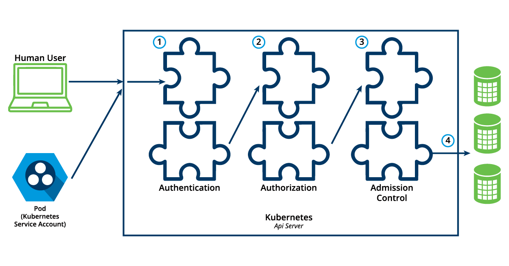

# Authentication, Authorization, Admission Control

## Chapter Overview

Every API request reaching the API server has to go through several control stages before being accepted by the server and acted upon. In this chapter, we will learn about the Authentication, Authorization, and Admission Control stages of the Kubernetes API access control.

## Learning Objectives

By the end of this chapter, you should be able to:

Discuss the authentication, authorization, and access control stages of the Kubernetes API access.
Understand the different kinds of Kubernetes users.
Explore the different modules for authentication and authorization.

- `Authentication`, Authorization, and Admission Control - Overview
To access and manage Kubernetes resources or objects in the cluster, we need to access a specific API endpoint on the API server. Each access request goes through the following access control stages:

- `Authentication`
Authenticate a user based on credentials provided as part of API requests.

- `Authorization`
Authorizes the API requests submitted by the authenticated user.
Admission Control
Software modules that validate and/or modify user requests.
The following image depicts the above stages:



(Retrieved from [kubernetes.io](https://kubernetes.io/docs/concepts/security/controlling-access/))

## Authentication

Kubernetes does not have a *`user`* object, nor does it store usernames or other related details in its object store. However, it can still use usernames for the [`Authentication`](https://kubernetes.io/docs/reference/access-authn-authz/authentication/) phase of API access control and for request logging.

Kubernetes supports two kinds of [users](https://kubernetes.io/docs/reference/access-authn-authz/authentication/#users-in-kubernetes):

- `Normal Users`: These are managed outside the Kubernetes cluster through independent services like User/Client Certificates, a file listing usernames/passwords, Google accounts, etc.
- `Service Accounts`: These allow in-cluster processes to communicate with the API server to perform various operations. Most Service Accounts are created automatically via the API server, but they can also be created manually. Service Accounts are tied to a particular Namespace and mount their respective credentials to communicate with the API server as Secrets.

If properly configured, Kubernetes can also support [`anonymous requests`](https://kubernetes.io/docs/reference/access-authn-authz/authentication/#anonymous-requests), along with requests from Normal Users and Service Accounts. [`User impersonation`](https://kubernetes.io/docs/reference/access-authn-authz/authentication/#user-impersonation) is also supported, allowing a user to act as another user, which is a helpful feature for administrators when troubleshooting authorization policies.

For authentication, Kubernetes uses a series of [`authentication modules`](https://kubernetes.io/docs/reference/access-authn-authz/authentication/#authentication-strategies):

- `X509 Client Certificates`: To enable client certificate authentication, you pass the `--client-ca-file=SOMEFILE` option to the API server. The certificate authorities in the file validate client certificates presented by users.
- `Static Token File`: You can pass a file containing pre-defined bearer tokens with the `--token-auth-file=SOMEFILE` option to the API server. These tokens last indefinitely and cannot be changed without restarting the API server.
- `Bootstrap Tokens`: Tokens used for bootstrapping new Kubernetes clusters.
- `Service Account Tokens`: Automatically enabled authenticators that use signed bearer tokens to verify requests. These tokens are attached to Pods using the Service Account Admission Controller, allowing in-cluster processes to communicate with the API server.
- `OpenID Connect Tokens`: OpenID Connect helps connect with OAuth2 providers, such as Microsoft Entra ID (previously known as Azure Active Directory), Salesforce, and Google, to offload authentication to external services.
- `Webhook Token Authentication`: With Webhook-based authentication, verification of bearer tokens can be offloaded to a remote service.
- `Authenticating Proxy`: Allows for the programming of additional authentication logic.

You can enable multiple authenticators. The first module to successfully authenticate the request short-circuits the evaluation. To ensure successful user authentication, you should enable at least two methods: the service account tokens authenticator and one of the user authenticators.

## Authorization

After successful authentication, users can send API requests to perform different operations. These API requests are then [`authorized`](https://kubernetes.io/docs/reference/access-authn-authz/authorization/) by Kubernetes using various authorization modules that allow or deny the requests.

Some of the API request attributes reviewed by Kubernetes include user, group, Resource, Namespace, or API group, to name a few. These attributes are then evaluated against policies. If the evaluation is successful, the request is allowed; otherwise, it is denied. Similar to the Authentication step, Authorization has multiple modules, or authorizers. More than one module can be configured for one Kubernetes cluster, and each module is checked in sequence. If any authorizer approves or denies a request, that decision is returned immediately.

## Authorization Modes

### Node

Node authorization is a special-purpose authorization mode that specifically authorizes API requests made by `kubelets`. It authorizes the kubelet's read operations for services, endpoints, or nodes, and write operations for nodes, pods, and events. For more details, please review the [Node authorization documentation](https://kubernetes.io/docs/reference/access-authn-authz/node/).

### Attribute-Based Access Control (ABAC)

With the `ABAC` authorizer, Kubernetes grants access to `API` requests by combining policies with attributes. In the following example, user `bob` can only read Pods in the Namespace `lfs158`.

```json
{
  "apiVersion": "abac.authorization.kubernetes.io/v1beta1",
  "kind": "Policy",
  "spec": {
    "user": "bob",
    "namespace": "lfs158",
    "resource": "pods",
    "readonly": true
  }
}
```

To enable ABAC mode, start the API server with the `--authorization-mode=ABAC` option, while specifying the authorization policy with `--authorization-policy-file=PolicyFile.json`. For more details, please review the [ABAC authorization documentation](https://kubernetes.io/docs/reference/access-authn-authz/abac/).

### Webhook

In Webhook mode, Kubernetes can request authorization decisions to be made by third-party services, which would return `true` for successful authorization and `false` for failure. To enable the Webhook authorizer, you need to start the API server with the `--authorization-webhook-config-file=SOME_FILENAME` option, where `SOME_FILENAME` is the configuration of the remote authorization service. For more details, please see the [Webhook mode documentation](https://kubernetes.io/docs/reference/access-authn-authz/webhook/).

### Role-Based Access Control (RBAC)

In general, with RBAC, we regulate access to resources based on the Roles of individual users. In Kubernetes, multiple Roles can be attached to subjects like users, service accounts, etc. While creating the Roles, we restrict resource access by specific operations, such as `create`, `get`, `update`, `patch`, etc. These operations are referred to as verbs. In RBAC, we can create two kinds of Roles:

- `Role`: A Role grants access to resources within a specific Namespace.
- `ClusterRole`: A ClusterRole grants the same permissions as a Role but its scope is cluster-wide.

Below you will find an example of a `Role`:

```yaml
apiVersion: rbac.authorization.k8s.io/v1
kind: Role
metadata:
  namespace: lfs158
  name: pod-reader
rules:
- apiGroups: [""] # "" indicates the core API group
  resources: ["pods"]
  verbs: ["get", "watch", "list"]
```

The manifest defines a `pod-reader` role, which has access only to read the Pods of the `lfs158` Namespace.

For comparison, a `ClusterRole` example is provided below:

```yaml
apiVersion: rbac.authorization.k8s.io/v1
kind: ClusterRole
metadata:
  name: cluster-admin
rules:
- apiGroups:
  - '*' # All API groups
  resources:
  - '*' # All resources
  verbs:
  - '*' # All operations
- nonResourceURLs:
  - '*' # All non resource URLs, such as "/healthz"
  verbs:
  - '*' # All operations
```

The manifest defines a `cluster-admin` cluster role that is fully permissive.

Once the role is created, we can bind it to users with a `RoleBinding` object. There are two kinds of RoleBindings:

- `RoleBinding`: It allows us to bind users to the same namespace as a Role. We could also refer to a `ClusterRole` in `RoleBinding`, which would grant permissions to Namespace resources defined in the `ClusterRole` within the `RoleBinding`’s Namespace.
- `ClusterRoleBinding`: It allows us to grant access to resources at a cluster-level and to all Namespaces.

Below, you will find an example of a `RoleBinding`:

```yaml
apiVersion: rbac.authorization.k8s.io/v1
kind: RoleBinding
metadata:
  name: pod-read-access
  namespace: lfs158
subjects:
- kind: User
  name: bob
  apiGroup: rbac.authorization.k8s.io
roleRef:
  kind: Role
  name: pod-reader
  apiGroup: rbac.authorization.k8s.io
```

The manifest defines a bind between the `pod-reader` Role and user `bob`, to restrict the user to only read the Pods of the `lfs158` Namespace.

For comparison, a `ClusterRoleBinding` example is provided below:

```yaml
apiVersion: rbac.authorization.k8s.io/v1
kind: ClusterRoleBinding
metadata:
  name: cluster-admin
roleRef:
  apiGroup: rbac.authorization.k8s.io
  kind: ClusterRole
  name: cluster-admin
subjects:
- apiGroup: rbac.authorization.k8s.io
  kind: Group
  name: system:admins
```

The manifest defines a bind between the `cluster-admin` `ClusterRole` and all users of the group `system:admins`.

To enable the RBAC mode, start the API server with the `--authorization-mode=RBAC` option, allowing you to dynamically configure policies. For more details, please review the [RBAC mode documentation](https://kubernetes.io/docs/reference/access-authn-authz/rbac/).

## Authentication and Authorization Demo Guide

This guide demonstrates authentication and authorization in Kubernetes, assuming a Minikube environment that uses certificates and keys from `/var/lib/minikube/certs/` and RBAC mode for authorization.

`Environment:`

- `Minikube v1.32`
- `Kubernetes v1.28`
- `containerd 1.7.8`

## 1\. Start Minikube and View Default Configuration

First, start your Minikube cluster:

```bash
$ minikube start
```

Next, view the `kubectl` client's configuration manifest. Observe the default `minikube` context and `minikube` user, along with their associated certificate and key paths.

```bash
$ kubectl config view
```

```yaml
apiVersion: v1
clusters:
- cluster:
    certificate-authority: /home/student/.minikube/ca.crt
    server: https://192.168.99.100:8443
  name: minikube
contexts:
- context:
    cluster: minikube
    namespace: default
    user: minikube
  name: minikube
current-context: minikube
kind: Config
preferences: {}
users:
- name: minikube
  user:
    client-certificate: /home/student/.minikube/profiles/minikube/client.crt
    client-key: /home/student/.minikube/profiles/minikube/client.key
```

## 2\. Create Namespace and User Setup

Create a new namespace called `lfs158`:

```bash
$ kubectl create namespace lfs158
namespace/lfs158 created
```

Create a directory for RBAC-related files and navigate into it:

```bash
$ mkdir rbac
$ cd rbac/
```

Create a new system user named `bob` on your workstation and set a password for him when prompted:

```bash
~/rbac$ sudo useradd -s /bin/bash bob
~/rbac$ sudo passwd bob
```

## 3\. Generate User Certificates

Generate a private key for `bob` using `openssl`:

```bash
~/rbac$ openssl genrsa -out bob.key 2048
Generating RSA private key, 2048 bit long modulus (2 primes)
.................................................+++++
.........................+++++
e is 65537 (0x010001)
```

Create a certificate signing request (CSR) for `bob` with the `openssl` tool. The `/CN=bob` sets the Common Name to `bob`, which Kubernetes uses as the username. `/O=learner` sets the Organization to `learner`, which can be used for grouping users.

```bash
~/rbac$ openssl req -new -key bob.key \
  -out bob.csr -subj "/CN=bob/O=learner"
```

## 4\. Create and Approve Certificate Signing Request (CSR) in Kubernetes

Create a YAML definition for a `CertificateSigningRequest` object. Initially, leave the `request` field blank.

```yaml
# ~/rbac$ vim signing-request.yaml
apiVersion: certificates.k8s.io/v1
kind: CertificateSigningRequest
metadata:
  name: bob-csr
spec:
  groups:
  - system:authenticated
  request: <assign encoded value from next cat command>
  signerName: kubernetes.io/kube-apiserver-client
  usages:
  - digital signature
  - key encipherment
  - client auth
```

Now, view the content of `bob.csr`, encode it in `base64`, and remove newlines and `%` characters. Then, paste this encoded value into the `request` field of `signing-request.yaml`.

```bash
~/rbac$ cat bob.csr | base64 | tr -d '\n','%'
LS0tLS1CRUd...1QtLS0tLQo=
```

Update `signing-request.yaml` with the `base64` encoded CSR:

```yaml
# ~/rbac$ vim signing-request.yaml
apiVersion: certificates.k8s.io/v1
kind: CertificateSigningRequest
metadata:
  name: bob-csr
spec:
  groups:
  - system:authenticated
  request: LS0tLS1CRUd...1QtLS0tLQo= # This value will be the base64 encoded bob.csr
  signerName: kubernetes.io/kube-apiserver-client
  usages:
  - digital signature
  - key encipherment
  - client auth
```

Create the `CertificateSigningRequest` object in Kubernetes and verify its `Pending` status:

```bash
~/rbac$ kubectl create -f signing-request.yaml
certificatesigningrequest.certificates.k8s.io/bob-csr created

~/rbac$ kubectl get csr
NAME      AGE    SIGNERNAME                        REQUESTOR       CONDITION
bob-csr   12s    kubernetes.io/kube-apiserver-client   minikube-user   Pending
```

Approve the CSR, which will change its status to `Approved,Issued`:

```bash
~/rbac$ kubectl certificate approve bob-csr
certificatesigningrequest.certificates.k8s.io/bob-csr approved

~/rbac$ kubectl get csr
NAME      AGE    SIGNERNAME                        REQUESTOR       CONDITION
bob-csr   57s    kubernetes.io/kube-apiserver-client   minikube-user   Approved,Issued
```

## 5\. Extract and Configure Bob's Certificate

Extract the approved certificate from the CSR object, decode it from `base64`, and save it as `bob.crt`. Then, view the content of `bob.crt`.

```bash
~/rbac$ kubectl get csr bob-csr \
  -o jsonpath='{.status.certificate}' | \
  base64 -d > bob.crt

~/rbac$ cat bob.crt
-----BEGIN CERTIFICATE-----
MIIDGzCCA...
...
...NOZRRZBVunTjK7A==
-----END CERTIFICATE-----
```

Configure `kubectl` with `bob`'s credentials (client certificate and private key):

```bash
~/rbac$ kubectl config set-credentials bob \
  --client-certificate=bob.crt --client-key=bob.key
User "bob" set.
```

Create a new `kubectl` context called `bob-context` for user `bob`, associated with the `lfs158` namespace in the `minikube` cluster:

```bash
~/rbac$ kubectl config set-context bob-context \
  --cluster=minikube --namespace=lfs158 --user=bob
Context "bob-context" created.
```

View the `kubectl` configuration again to confirm the new `bob-context` and `bob` user entries:

```bash
~/rbac$ kubectl config view
```

```yaml
apiVersion: v1
clusters:
- cluster:
    certificate-authority: /home/student/.minikube/ca.crt
    ...
    server: https://192.168.99.100:8443
  name: minikube
contexts:
- context:
    cluster: minikube
    ...
    user: minikube
  name: minikube
- context:
    cluster: minikube
    namespace: lfs158
    user: bob
  name: bob-context
current-context: minikube
kind: Config
preferences: {}
users:
- name: minikube
  user:
    client-certificate: /home/student/.minikube/profiles/minikube/client.crt
    client-key: /home/student/.minikube/profiles/minikube/client.key
- name: bob
  user:
    client-certificate: /home/student/rbac/bob.crt
    client-key: /home/student/rbac/bob.key
```

## 6\. Test Authorization (Before RBAC)

While still in the default `minikube` context, create a new deployment in the `lfs158` namespace:

```bash
~/rbac$ kubectl -n lfs158 create deployment nginx --image=nginx:alpine
deployment.apps/nginx created
```

Now, try to list pods using the newly created `bob-context`. This attempt should fail because user `bob` currently has no explicit permissions configured for this context.

```bash
~/rbac$ kubectl --context=bob-context get pods
Error from server (Forbidden): pods is forbidden: User "bob" cannot list resource "pods" in API group "" in the namespace "lfs158"
```

## 7\. Configure RBAC Permissions for Bob

The following steps will assign a limited set of permissions to user `bob` in the `bob-context` using Kubernetes RBAC.

Create a YAML configuration manifest for a `Role` object named `pod-reader`. This role will only allow `get`, `watch`, and `list` actions (verbs) on `pod` resources within the `lfs158` namespace.

```yaml
# ~/rbac$ vim role.yaml
apiVersion: rbac.authorization.k8s.io/v1
kind: Role
metadata:
  name: pod-reader
  namespace: lfs158
rules:
- apiGroups: [""] # "" indicates the core API group
  resources: ["pods"]
  verbs: ["get", "watch", "list"]
```

Create the `Role` object and list it from the default `minikube` context, specifically for the `lfs158` namespace:

```bash
~/rbac$ kubectl create -f role.yaml
role.rbac.authorization.k8s.io/pod-reader created

~/rbac$ kubectl -n lfs158 get roles
NAME         CREATED AT
pod-reader   2022-04-11T03:47:45Z
```

Create a YAML configuration manifest for a `RoleBinding` object. This `RoleBinding` will assign the permissions defined in the `pod-reader` Role to user `bob`.

```yaml
# ~/rbac$ vim rolebinding.yaml
apiVersion: rbac.authorization.k8s.io/v1
kind: RoleBinding
metadata:
  name: pod-read-access
  namespace: lfs158
subjects:
- kind: User
  name: bob
  apiGroup: rbac.authorization.k8s.io
roleRef:
  kind: Role
  name: pod-reader
  apiGroup: rbac.authorization.k8s.io
```

Create the `RoleBinding` object and list it from the default `minikube` context for the `lfs158` namespace:

```bash
~/rbac$ kubectl create -f rolebinding.yaml
rolebinding.rbac.authorization.k8s.io/pod-read-access created

~/rbac$ kubectl -n lfs158 get rolebindings
NAME              ROLE              AGE
pod-read-access   Role/pod-reader   28s
```

## 8\. Test Authorization (After RBAC)

Now that permissions have been assigned to `bob` via the `pod-reader` Role and `pod-read-access` RoleBinding, `bob` can successfully list pods from the `bob-context`:

```bash
~/rbac$ kubectl --context=bob-context get pods
NAME                          READY   STATUS    RESTARTS   AGE
nginx-565785f75c-kl25r        1/1     Running   0          7m41s
```

## Admission Control

[`Admission controllers`](https://kubernetes.io/docs/reference/access-authn-authz/admission-controllers/) are used to specify granular access control policies, which include allowing privileged containers, checking on resource quota, etc. We force these policies using different admission controllers, like LimitRanger, ResourceQuota, DefaultStorageClass, AlwaysPullImages, etc. They come into effect only after API requests are authenticated and authorized. Admission controllers fall under two categories - validating or mutating, but there are controllers that are both validating and mutating. The mutating controllers can modify the requested objects.

To use admission controls, we must start the Kubernetes API server with the --enable-admission-plugins, which takes a comma-delimited, ordered list of controller names, such as:

```bash
--enable-admission-plugins=NamespaceLifecycle,ResourceQuota,PodSecurity,DefaultStorageClass
```

Kubernetes has some admission controllers enabled by default. For more details, please review the [`list of admission controllers`](https://kubernetes.io/docs/reference/access-authn-authz/admission-controllers/#what-does-each-admission-controller-do).

Kubernetes admission control can also be implemented though custom plugins, for a [`dynamic admission control`](https://kubernetes.io/docs/reference/access-authn-authz/extensible-admission-controllers/) method. These plugins are developed as extensions and run as admission webhooks.