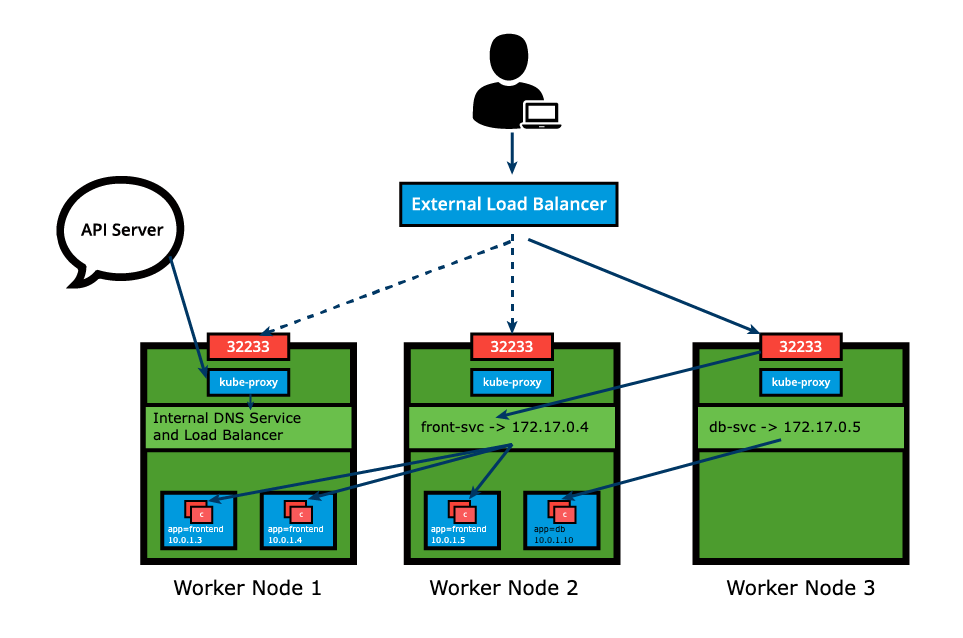
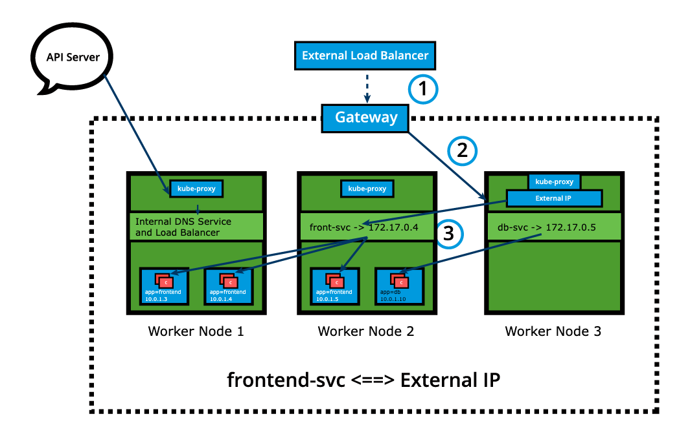

# Services

## Chapter Overview

Although the microservices driven architecture aims to decouple the components of an application, microservices still need agents to logically tie or group them together for management purposes, or to load balance traffic to the ones that are part of such a logical set.

In this chapter, we will learn about [Service](https://kubernetes.io/docs/concepts/services-networking/service/) objects used to abstract the communication between cluster internal microservices, or with the external world. A `Service` offers a single `DNS` entry for a stateless containerized application managed by the Kubernetes cluster, regardless of the number of its replicas, by providing a common load balancing access point to a set of pods logically grouped and managed by a controller such as a `Deployment`, `ReplicaSet`, or `DaemonSet`.

We will also learn about the `kube-proxy daemon`, which runs on each control plane and worker node to implement the services' configuration and to provide access to services. In addition we will discuss service discovery and service types, which decide the access scope of a service.

## Learning Objectives

By the end of this chapter, you should be able to:

- Discuss the benefits of logically grouping Pods with Services to access an application.
- Explain the role of the kube-proxy daemon running on each node.
- Explore the Service discovery options available in Kubernetes.
- Discuss different Service types.

## Accessing Application Pods

To access the application, a user or another application needs to connect to a Pod running the target application. As Pods are ephemeral in nature, resources like IP addresses allocated to them cannot be static. Pods could be terminated abruptly or be rescheduled based on existing requirements.

Let's take, for example, a scenario where an operator manages a set of Pods and a user/client is accessing the Pods directly by using their individual IP addresses. This access method requires the client to retrieve the target Pods’ IP addresses in advance, introducing an unnecessary overhead for the client.


Unexpectedly, one of the Pods the user/client is accessing is terminated, and a new Pod is created by the controller. The new Pod will be assigned a new IP address that will not be immediately known by the user/client. If the client tries to watch the target Pods’ IP addresses for any changes and updates, this will result in an inefficient approach that will only increase the client’s overhead.


To overcome this situation, Kubernetes provides a higher-level abstraction called *Service*, which logically groups Pods and defines a policy to access them. This grouping is achieved via *Labels* and *Selectors*. This logical grouping strategy is used by Pod controllers, such as `ReplicaSets`, `Deployments`, and even `DaemonSets`. Below is a Deployment definition manifest for the frontend app, to aid with the correlation of `Labels`, `Selectors`, and port values between the Deployment controller, its Pod replicas, and the Service definition manifest presented in an upcoming section.

```yaml
apiVersion: apps/v1
kind: Deployment
metadata:
  labels:
    app: frontend
  name: frontend
spec:
  replicas: 3
  selector:
    matchLabels:
      app: frontend
    template:
      metadata:
        labels:
          app: frontend
      spec:
        containers:
        - image: frontend-application
        name: frontend-application
        ports:
        - containerPort: 5000
```

## Services

`Labels` and `Selectors` use a *key-value* pair format. In the following graphical representation, `app` is the Label *key*, `frontend` and `db` are Label *values* for different Pods.


Using the selectors `app==frontend` and `app==db`, we group `Pods` into two logical sets: one set with 3 Pods, and one set with a single Pod.

We assign a name to the logical grouping, referred to as a *Service*. The `Service` name is also registered with the cluster's internal DNS service. In our example, we create two Services, frontend-svc, and db-svc, and they have the `app==frontend` and the `app==db `Selectors, respectively.

`Services` can expose single `Pods`, `ReplicaSets`, `Deployments`, `DaemonSets`, and `StatefulSets`. When exposing the `Pods` managed by an operator, the Service's Selector may use the same label(s) as the operator. A clear benefit of a Service is that it watches application Pods for any changes in count and their respective IP addresses while automatically updating the list of corresponding endpoints. Even for a single-replica application, run by a single Pod, the Service is beneficial during self-healing (replacement of a failed Pod) as it immediately directs traffic to the newly deployed healthy Pod.

## Service Object Example

This section provides an example of a Service object definition, demonstrating the declarative method for defining an object. This can serve as a template for more complex Service definitions. Omitting the `Service type` from the definition manifest creates the default service type, `ClusterIP`.

```yaml
apiVersion: v1
kind: Service
metadata:
  name: frontend-svc
spec:
  selector:
    app: frontend
  ports:
  - protocol: TCP
    port: 80
    targetPort: 5000
```

The above definition manifest, if stored as a `frontend-svc.yaml` file, can be loaded into the cluster to set up the necessary routes and rules to send traffic to the Pod replicas of the earlier defined `frontend` Deployment. While `create` is exemplified below, advanced Kubernetes practitioners may opt to use `apply` instead:

```bash
$ kubectl create -f frontend-svc.yaml
```

Imperatively, you can use a direct method to expose a Deployment's Pods. The following is a multi-line command:

```bash
$ kubectl expose deploy frontend --name=frontend-svc \
--port=80 --target-port=5000
```

The `expose` command parses the referenced Deployment object to extract valuable pairing details such as Name, Label, Selector, and `containerPort` to populate these values in the Service object. However, especially when the Service `port` and Service `targetPort` values are expected to be distinct (80 and 5000 respectively), it is best to explicitly supply these values with the `expose` command. Additionally, the Service name can be changed with the `name` option (the default behavior is for the Service object to inherit the exposed Deployment’s name `frontend`).

Another imperative method to set up the same Service is through the `create service` command. The command below first sets up a `frontend` Service with `frontend` Label and `frontend` Selector in `dry-run` mode, updates the Service name to `frontend-svc`, and then loads the definition into the cluster. The following is a multi-line command:

```bash
$ kubectl create service clusterip frontend \
--tcp=80:5000 --dry-run=client -o yaml \
| sed 's/name: frontend/name: frontend-svc/g' \
| kubectl apply -f -
```

In this example, we are creating a `frontend-svc` Service by selecting all Pods that have the Label `key=app` set to `value=frontend`. By default, each Service receives an IP address routable only inside the cluster, known as `ClusterIP`. In our example, we have `172.17.0.4` and `172.17.0.5` as ClusterIPs assigned to our `frontend-svc` and `db-svc` Services, respectively.


The user/client connects to a Service via its `ClusterIP`, which forwards traffic to one of the Pods attached to it. A Service provides load balancing by default when selecting Pods for traffic forwarding.

While the Service forwards traffic to Pods, we can select the `targetPort` on the Pod which receives the traffic. In our example, the `frontend-svc` Service receives requests from the user/client on `port: 80` and then forwards these requests to one of the attached Pods on the `targetPort: 5000`. If the `targetPort` is not defined explicitly, then traffic will be forwarded to Pods on the `port` on which the Service receives traffic (in this case, the `targetPort` implicitly is assigned the value of the `port`). It is very important to ensure that the value of the `targetPort`, which is `5000` in this example, matches the value of the `containerPort` property of the Pod `spec` section.

A logical set of a Pod's IP address, along with the `targetPort`, is referred to as a `Service endpoint`. In our example, the `frontend-svc` Service has 3 endpoints: `10.0.1.3:5000`, `10.0.1.4:5000`, and `10.0.1.5:5000` respectively. Endpoints are created and managed automatically by the Service, not by Kubernetes cluster administrators or developers.

The Service and associated endpoints can be listed with:

```bash
$ kubectl get service,endpoints frontend-svc
$ kubectl get svc,ep frontend-svc
```

## kube-proxy

Each cluster node runs a `daemon` called [`kube-proxy`](https://kubernetes.io/docs/concepts/services-networking/service/#virtual-ips-and-service-proxies), a node agent that watches the API server on the control plane node for the `addition`, `updates`, and `removal` of `Services` and `endpoints`. `kube-proxy` is responsible for implementing the Service configuration on behalf of an administrator or developer, in order to enable traffic routing to an exposed application running in Pods. In the example below, for each new Service, on each node, `kube-proxy` configures `iptables` rules to capture the traffic for its `ClusterIP` and forwards it to one of the Service's endpoints. Therefore, any node can receive the external traffic and then route it internally in the cluster based on the `iptables` rules. When the Service is removed, `kube-proxy` removes the corresponding `iptables` rules on all nodes as well.

Just as the `kube-proxy` node agent runs redundantly on each cluster node, the `iptables` are populated in a redundant fashion by their respective node agents so that each `iptables` instance stores complete routing rules for the entire cluster. This helps with the Service objects implementation to reproduce a distributed load balancing mechanism.


## Traffic Policies

The `kube-proxy` node agent together with `iptables` implement the load-balancing mechanism of the Service when traffic is being routed to the application Endpoints. Due to restricting characteristics of `iptables`, this load-balancing is random by default. This means that the Endpoint Pod to receive the request forwarded by the Service will be randomly selected out of many replicas. This mechanism does not guarantee that the selected receiving Pod is the closest or even on the same node as the requester, therefore not the most efficient mechanism. Since this is the `iptables` supported load-balancing mechanism, if we desire better outcomes, we would need to take advantage of traffic policies.

[`Traffic policies`](https://kubernetes.io/docs/reference/networking/virtual-ips/#traffic-policies) allow users to instruct `kube-proxy` on the context of the traffic routing. The two options are `Cluster` and `Local`:

- The ``Cluster`` option allows `kube-proxy` to target all ready Endpoints of the Service in the load-balancing process. This is the default behavior of the Service even when the traffic policy property is not explicitly declared.
- The ``Local`` option, however, isolates the load-balancing process to only include the Endpoints of the Service located on the same node as the requester Pod, or perhaps the node that captured inbound external traffic on its NodePort. While this sounds like an ideal option, it does have a shortcoming - if the Service does not have a ready Endpoint on the node where the requester Pod is running, the Service will not route the request to Endpoints on other nodes to satisfy the request because it will be dropped by `kube-proxy`.

Both the `Cluster` and `Local` options are available for requests generated internally from within the cluster, or externally from applications and clients running outside the cluster. The Service definition manifest below defines both internal and external Local traffic policies. Both are optional settings and can be used independently of each other, where one can be defined without the other (either internal or external policy).

```yaml
apiVersion: v1
kind: Service
metadata:
  name: frontend-svc
spec:
  selector:
    app: frontend
  ports:
    - protocol: TCP
      port: 80
      targetPort: 5000
  internalTrafficPolicy: Local
  externalTrafficPolicy: Local
```

## Service Discovery

As Services are the primary mode of communication between containerized applications managed by Kubernetes, it is helpful to be able to discover them at runtime. Kubernetes supports two methods for discovering Services: Environment variables and DNS.

## Methods for Discovering Services

### Environment Variables

As soon as a Pod starts on any worker node, the `kubelet` daemon running on that node adds a set of environment variables in the Pod for all active Services. For example, if we have an active Service called `redis-master`, which exposes port `6379`, and its `ClusterIP` is `172.17.0.6`, then, on a newly created Pod, we can see the following environment variables:

```properties
REDIS_MASTER_SERVICE_HOST=172.17.0.6
REDIS_MASTER_SERVICE_PORT=6379
REDIS_MASTER_PORT=tcp://172.17.0.6:6379
REDIS_MASTER_PORT_6379_TCP=tcp://172.17.0.6:6379
REDIS_MASTER_PORT_6379_TCP_PROTO=tcp
REDIS_MASTER_PORT_6379_TCP_PORT=6379
REDIS_MASTER_PORT_6379_TCP_ADDR=172.17.0.6
```

With this solution, we need to be careful while ordering our Services, as the Pods will not have the environment variables set for Services which are created after the Pods are created.

### DNS

Kubernetes has an add-on for [DNS](https://kubernetes.io/docs/concepts/services-networking/dns-pod-service/), which creates a DNS record for each Service in the format `my-svc.my-namespace.svc.cluster.local`. Services within the same Namespace can find other Services just by their names. For example, if we add a Service `redis-master` in the `my-ns` Namespace, all Pods in the same `my-ns` Namespace can look up the Service just by its name, `redis-master`. Pods from other Namespaces, such as `test-ns`, can look up the same Service by adding the respective Namespace as a suffix, such as `redis-master.my-ns`, or by providing the FQDN of the service as `redis-master.my-ns.svc.cluster.local`.

This is the most common and highly recommended solution. For example, an internal DNS is configured, which maps our Services `frontend-svc` and `db-svc` to `172.17.0.4` and `172.17.0.5` IP addresses respectively.

If we had a client application accessing the frontend application, the client would only need to “know” the frontend application’s Service name and port, which are `frontend-svc` and port `80` respectively. From a client application Pod, we could possibly run the following command, allowing for the cluster internal name resolution and `kube-proxy` to guide the client’s request to a frontend Pod:

```bash
$ kubectl exec client-app-pod-name -c client-container-name -- /bin/sh -c curl -s frontend-svc:80
```

## ServiceType

While defining a Service, we can also choose its access scope. We can decide whether the Service:

- Is only accessible within the cluster.
- Is accessible from within the cluster and the external world.
- Maps to an entity which resides either inside or outside the cluster.

Access scope is decided by the `ServiceType` property, defined when creating the Service.

### ServiceType: ClusterIP and NodePort

`ClusterIP` is the default [*ServiceType*](https://kubernetes.io/docs/concepts/services-networking/service/#publishing-services-service-types). A Service receives a Virtual IP address, known as its ClusterIP. This Virtual IP address is used for communicating with the Service and is accessible only from within the cluster. The `frontend-svc` Service definition manifest below explicitly includes `type: ClusterIP`. If omitted, the default ClusterIP service type is set up:

```yaml
apiVersion: v1
kind: Service
metadata:
  name: frontend-svc
spec:
  selector:
    app: frontend
  ports:
  - protocol: TCP
    port: 80
    targetPort: 5000
  type: ClusterIP
```

With the [`NodePort`](https://kubernetes.io/docs/concepts/services-networking/service/#type-nodeport) *ServiceType*, in addition to a ClusterIP, a high-port, dynamically picked from the default range `30000-32767`, is mapped to the respective Service from all the worker nodes. For example, if the mapped NodePort is `32233` for the service `frontend-svc`, then, if we connect to any worker node on port `32233`, the node would redirect all the traffic to the assigned ClusterIP - `172.17.0.4`. If we prefer a specific high-port number instead, then we can assign that high-port number to the NodePort from the default range when creating the Service.


The `NodePort` *ServiceType* is useful when we want to make our Services accessible from the external world. The end-user connects to any worker node on the specified high-port, which proxies the request internally to the ClusterIP of the Service, then the request is forwarded to the applications running inside the cluster. Let's not forget that the Service is load balancing such requests, and only forwards the request to one of the Pods running the desired application. To manage access to multiple application Services from the external world, administrators can configure a reverse proxy - an ingress, and define rules that target specific Services within the cluster.

The NodePort type has to be explicitly declared in the Service definition manifest or with the imperative methods explored in an earlier lesson - the `expose` and `create service` commands. Declaring the `nodePort` value `32233` is optional, ensuring there is no conflict. We are reusing the earlier definition and commands updated for the NodePort `type` and declaring the `nodePort` value where supported:

```yaml
apiVersion: v1
kind: Service
metadata:
  name: frontend-svc
spec:
  selector:
    app: frontend
  ports:
  - protocol: TCP
    port: 80
    targetPort: 5000
    nodePort: 32233
  type: NodePort
```

```bash
$ kubectl expose deploy frontend --name=frontend-svc \
--port=80 --target-port=5000 --type=NodePort
$ kubectl create service nodeport frontend-svc \
--tcp=80:5000 --node-port=32233
```

## ServiceType: LoadBalancer

With the [`LoadBalancer`](https://kubernetes.io/docs/concepts/services-networking/service/#loadbalancer) *ServiceType*:

- NodePort and ClusterIP are automatically created, and the external load balancer will route to them.
- The Service is exposed at a static port on each worker node.
- The Service is exposed externally using the underlying cloud provider's load balancer feature.



The `LoadBalancer` *ServiceType* will only work if the underlying infrastructure supports the automatic creation of Load Balancers and has the respective support in Kubernetes, as is the case with Google Cloud Platform and AWS. If no such feature is configured, the LoadBalancer IP address field is not populated, it remains in a Pending state, but the Service will still work as a typical NodePort type Service.

## ServiceType: ExternalIP

A Service can be mapped to an [`ExternalIP`](https://kubernetes.io/docs/concepts/services-networking/service/#external-ips) address if it can route to one or more of the worker nodes. Traffic that is `ingressed` into the cluster with the ExternalIP (as destination IP) on the Service port gets routed to one of the Service endpoints. This type of service requires an external cloud provider such as Google Cloud Platform or AWS and a Load Balancer configured on the cloud provider's infrastructure.



Please note that ExternalIPs are not managed by Kubernetes. The cluster administrator has to configure the routing which maps the ExternalIP address to one of the nodes.

## ServiceType: ExternalName

[`ExternalName`](https://kubernetes.io/docs/concepts/services-networking/service/#externalname) is a special *ServiceType* that has no Selectors and does not define any endpoints. When accessed within the cluster, it returns a `CNAME` record of an externally configured Service.

The primary use case of this *ServiceType* is to make externally configured Services like `my-database.example.com` available to applications inside the cluster. If the externally defined Service resides within the same Namespace, using just the name `my-database` would make it available to other applications and Services within that same Namespace.

## Multi-Port Services

A Service resource can expose multiple ports at the same time if required. Its configuration is flexible enough to allow for multiple groupings of ports to be defined in the manifest. This is a helpful feature when exposing Pods with one container listening on more than one port, or when exposing Pods with multiple containers listening on one or more ports.

A multi-port Service manifest is provided below:

```yaml
apiVersion: v1
kind: Service
metadata:
  name: my-service
spec:
  selector:
    app: myapp
  type: NodePort
  ports:
  - name: http
    protocol: TCP
    port: 8080
    targetPort: 80
    nodePort: 31080
  - name: https
    protocol: TCP
    port: 8443
    targetPort: 443
    nodePort: 31443
```

The `my-service` Service resource exposes Pods labeled `app==myapp` with possibly one container listening on ports `80` and `443`, as described by the two `targetPort` fields. The Service will be visible inside the cluster on its `ClusterIP` and ports `8080` and `8443` as described by the two `port` fields, and it will also be accessible to incoming requests from outside the cluster on the two `nodePort` fields `31080` and `31443`. When manifests describe multiple ports, they need to be named as well, for clarity, as described by the two `spec.port.name` fields with values `http` and `https` respectively. This Service is configured to capture traffic on ports 8080 and 8443 from within the cluster, or on ports 31080 and 31443 from outside the cluster, and forward that traffic to the ports 80 and 443 respectively of the Pods running the container.

## Port Forwarding

Another application exposure mechanism in Kubernetes is port forwarding. In Kubernetes, the port forwarding feature allows users to easily forward a local port to an application port. Thanks to its flexibility, the application port can be a Pod container port, a Service port, and even a Deployment container port (from its Pod template). This allows users to test and debug their application running in a remote cluster by targeting a port on their local workstation (either `http://localhost:port` or `http://127.0.0.1:port`), a solution for remote cloud clusters or virtualized on-premises clusters.

Port forwarding can be utilized as an alternative to the NodePort Service type because it does not require knowledge of the public IP address of the Kubernetes Node. As long as there are no firewalls blocking access to the desired local workstation port, such as 8080 in the examples below, the port forwarding method can quickly allow access to the application running in the cluster.

Based on the earlier explored `frontend` Deployment and `frontend-svc` Service, port forwarding can be easily achieved via one of the following methods:

```bash
$ kubectl port-forward deploy/frontend 8080:5000
$ kubectl port-forward frontend-77cbdf6f79-qsdts 8080:5000
$ kubectl port-forward svc/frontend-svc 8080:80
```

All three commands forward port 8080 of the local workstation to the container port 5000 of the Deployment and Pod respectively, and to the Service port 80. While the Pod resource type is implicit, therefore optional and can be omitted, the Deployment and Service resource types are required to be explicitly supplied in the presented syntax.