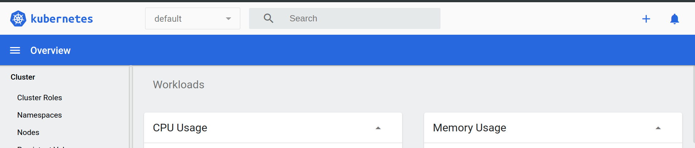
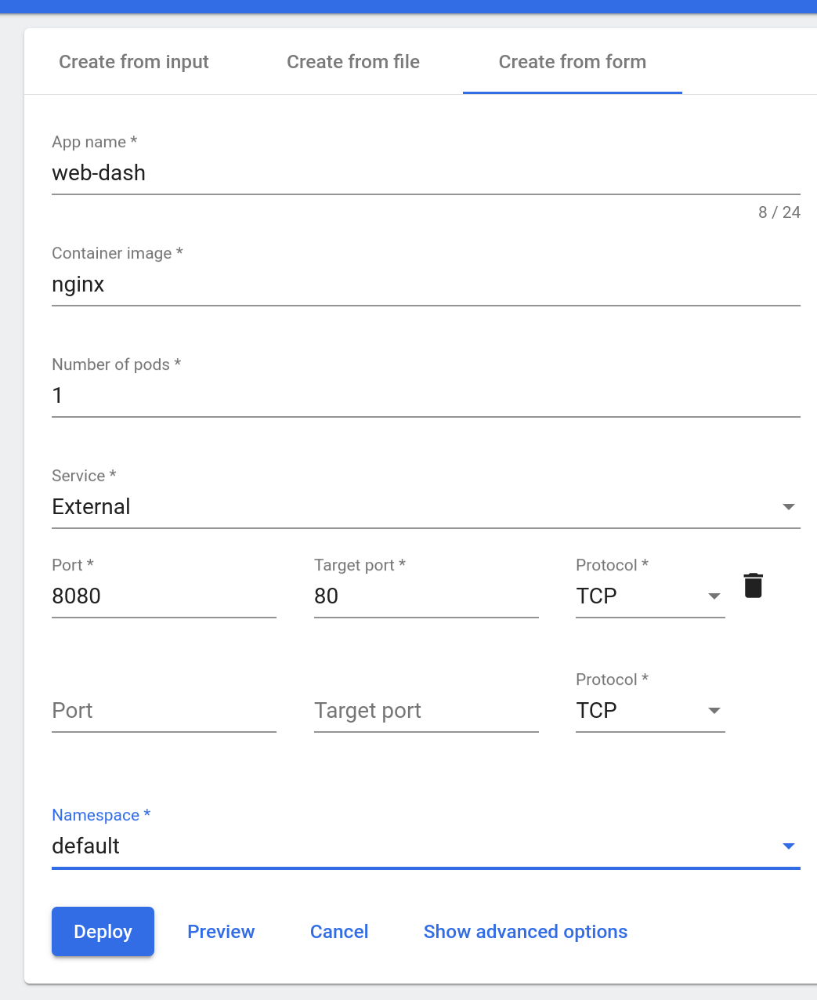
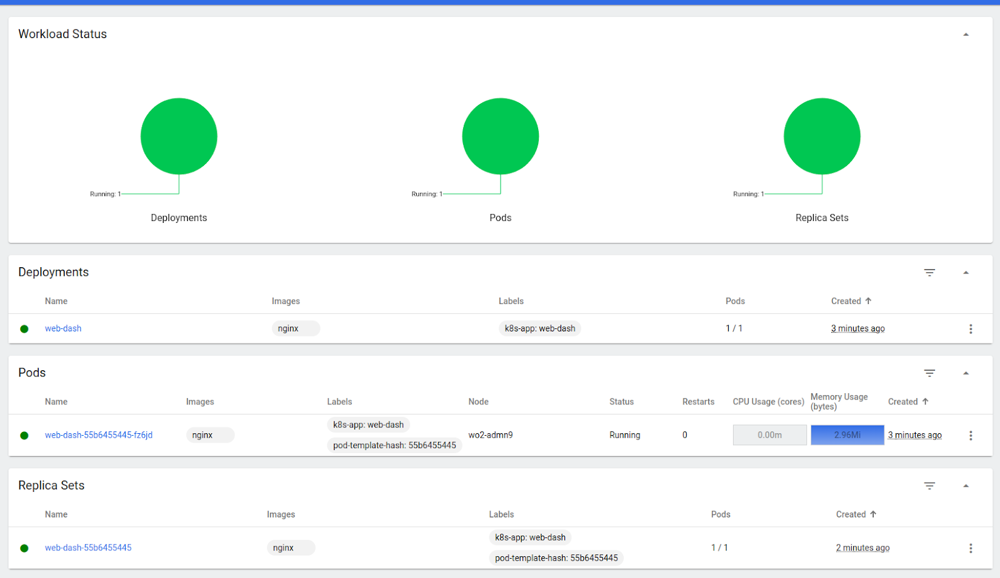

# Deploying a Standalone Application

## Chapter Overview

In this chapter, we will learn how to deploy an application using the Dashboard (Kubernetes WebUI) and the Command Line Interface (CLI). We will also expose the application with a NodePort type Service, and access it from outside the Minikube cluster.

## Learning Objectives

By the end of this chapter, you should be able to:

- Deploy an application from the dashboard.
- Deploy an application from a YAML file using kubectl.
- Expose a service using NodePort.
- Access the application from outside the Minikube cluster.

## Deploying an Application Using the Dashboard

Let's learn how to deploy an `nginx` webserver using the `nginx` container image from [Docker Hub](https://hub.docker.com/).

First, start Minikube and verify that it is running:

```bash
$ minikube start
```

Then verify Minikube status:

```bash
$ minikube status
```

Example output:

```bash
minikube
type: Control Plane
host: Running
kubelet: Running
apiserver: Running
kubeconfig: Configured
```

Now, start the Minikube Dashboard. To access the Kubernetes Web UI, run the following command:

```bash
$ minikube dashboard
```

Running this command will open a browser with the Kubernetes Web UI, which you can use to manage containerized applications. By default, the dashboard is connected to the `default` Namespace. Therefore, all operations will be performed inside the `default` Namespace.


*`NOTE`:* *In case the browser does not open a new tab and display the Dashboard as expected, verify the output in your terminal as it may display a link for the Dashboard (together with some error messages). Copy and paste that link into a new tab of your browser. Depending on your terminal's features, you may be able to just click or right-click the link to open directly in the browser.*

The link may look similar to:
[`http://127.0.0.1:40235/api/v1/namespaces/kubernetes-dashboard/services/https:kubernetes-dashboard:/proxy/`](http://127.0.0.1:40235/api/v1/namespaces/kubernetes-dashboard/services/https:kubernetes-dashboard:/proxy/)
Chances are that the only difference is the PORT number, which above is 40235. Your port number may be different.

After a logout/login or a reboot of your workstation, the expected behavior may be observed (where the `minikube dashboard` command directly opens a new tab in your browser displaying the Dashboard).

## Deploying an Application Using the Dashboard (2)

Deploy a webserver using the `nginx` image. From the dashboard, click on the "`+`" symbol at the top right corner of the Dashboard. That will open the create interface.



From there, you can create an application using valid YAML/JSON configuration data, from a definition manifest file, or manually from the `Create from form` tab. Click on the `Create from form` tab and provide the following application details:

- `The application name is` `web-dash`.
- `The container image to use is` `nginx`.
- `The replica count, or the number of Pods, is` `1`.
- `Service is External, Port 8080, Target port 80, Protocol TCP.`
- `Namespace is` `default`.



If you click on `Show Advanced Options`, you can specify options such as Labels, Namespace, Resource Requests, etc. By default, the Label is set to the application name. In our example `k8s-app: web-dash` Label is set to all objects created by this Deployment: Pods and Services (when exposed).

By clicking on the `Deploy` button, we trigger the deployment. As expected, the Deployment `web-dash` will create a ReplicaSet (`web-dash-74d8bd488f`), which will eventually create 1 Pod replica (`web-dash-74d8bd488f-dwbzz`).

`NOTE:` *Add the full URL in the Container Image field `docker.io/library/nginx` if any issues are encountered with the simple `nginx` image name (or use the `k8s.gcr.io/nginx` URL if it works instead).*

`NOTE:` *The resource names are unique and are provided for illustrative purposes only. The resources in your clusters and dashboards will display different names, but the naming structure follows the same convention.*

## Deploying an Application Using the Dashboard (3)

Once we create the `web-dash` Deployment, we can use the resource navigation panel from the left side of the Dashboard to display details of Deployments, ReplicaSets, and Pods in the `default` Namespace.

From the Dashboard, we can display individual objects’ properties by simply clicking the object’s name. From the commands menu symbol (the vertical three-dots) at the far-right, we can easily manage their state. Easily scale up the Deployment to a higher number of replicas, and observe the additional Pods spin up, or scale it down to fewer replicas. Attempt to delete one of the individual Pods of the Deployment. You'll notice that after a few seconds, the ReplicaSet creates a new Pod to maintain the desired replica count. We can even delete the Deployment, an action that results in all its Pod replicas being terminated. But for now, let’s keep the Deployment so we can analyze it further.




The resources displayed by the Dashboard match one-to-one resources displayed from the CLI via `kubectl`. List the Deployments. We can list all the Deployments in the `default` Namespace using the `kubectl get deployments` command:

```bash
$ kubectl get deployments
```

Example output:

```bash
NAME        READY   UP-TO-DATE   AVAILABLE   AGE
web-dash    1/1     1            1           9m
```

List the ReplicaSets. We can list all the ReplicaSets in the `default` Namespace using the `kubectl get replicasets` command:

```bash
$ kubectl get replicasets
```

Example output:

```bash
NAME                          DESIRED   CURRENT   READY   AGE
web-dash-74d8bd488f           1         1         1       9m
```

List the Pods. We can list all the Pods in the `default` namespace using the `kubectl get pods` command:

```bash
$ kubectl get pods
```

Example output:

```bash
NAME                                       READY   STATUS    RESTARTS   AGE
web-dash-74d8bd488f-dwbzz                  1/1     Running   0          9m
```

List Deployment, ReplicaSet and Pod with a single command:

```bash
$ kubectl get deploy,rs,po
```

## Exploring Labels and Selectors

Earlier, we have seen that labels and selectors play an important role in logically grouping a subset of objects to perform operations. Let's take a closer look at them.

Display the Pod's details. We can look at an object's details using the `kubectl describe` command. In the following example, you can see a Pod's description:

```bash
$ kubectl describe pod web-dash-74d8bd488f-dwbzz
```

Example output:

```bash
Name:            web-dash-74d8bd488f-dwbzz
Namespace:       default
Priority:        0
Service Account: default
Node:            minikube/192.168.99.100
Start Time:      Mon, 4 Mar 2024 13:17:33 -0500
Labels:          k8s-app=web-dash
                 pod-template-hash=74d8bd488f
Annotations:     <none>
Status:          Running
IP:              172.17.0.5
Controlled By:   ReplicaSet/web-dash-74d8bd488f
Containers:
  web-dash:
    Container ID:   containerd://96302d70903fe3b45d5ff3745a706d67d77411c5378f1f293a4bd721896d6420
    Image:          nginx
    Image ID:       docker.io/library/nginx@sha256:8d5341da24ccbdd195a82f2b57968ef5f95bc27b3c3691ace0c7d0acf5612edd
    Port:           <none>
    State:          Running
      Started:      Mon, 4 Mar 2024 13:17:33 -0500
    Ready:          True
    Restart Count:  0
...
```

The `kubectl describe` command displays many more details of a Pod. For now, however, we will focus on the `Labels` field, where we have a Label set to `k8s-app=web-dash`.

## Exploring Labels and Selectors (2)

List the Pods, along with their attached Labels. With the `-L` option to the `kubectl get pods` command, we add extra columns in the output to list Pods with their attached Label keys and their values. In the following example, we are listing Pods with the Label keys `k8s-app` and `label2`:

```bash
$ kubectl get pods -L k8s-app,label2
```

Example output:

```bash
NAME                                       READY   STATUS    RESTARTS   AGE   K8S-APP    LABEL2
web-dash-74d8bd488f-dwbzz                  1/1     Running   0          14m   web-dash
```

All of the Pods are listed, as each Pod has the Label key `k8s-app` with value set to `web-dash`. We can see that in the `K8S-APP` column. As none of the Pods have the `label2` Label key, no values are listed under the `LABEL2` column.

Select the Pods with a given Label. To use a selector with the `kubectl get pods` command, we can use the `-l` option. In the following example, we are selecting all the Pods that have the `k8s-app` Label key set to value `web-dash`:

```bash
$ kubectl get pods -l k8s-app=web-dash
```

Example output:

```bash
NAME                                       READY   STATUS    RESTARTS   AGE
web-dash-74d8bd488f-dwbzz                  1/1     Running   0          17m
```

In the example above, we listed all the Pods we created, as all of them have the `k8s-app` Label key set to value `web-dash`.

Try using `k8s-app=webserver` as the Selector:

```bash
$ kubectl get pods -l k8s-app=webserver
```

Example output:

```bash
No resources found.
```

As expected, no Pods are listed.

# Deploying an Application Using the CLI (1)

To deploy an application using the CLI, let's first delete the Deployment we created earlier.

One method to delete the Deployment we created earlier is from the Dashboard, from the Deployment’s commands menu. Another method is using the `kubectl delete` command. Next, we are deleting the `web-dash` Deployment we created earlier:

```bash
$ kubectl delete deployments web-dash
```

Example output:

```
deployment.apps "web-dash" deleted
```

Deleting a Deployment also deletes the ReplicaSet and the Pods it created:

```bash
$ kubectl get replicasets
```

Example output:

```
No resources found.
```

```bash
$ kubectl get pods
```

Example output:

```
No resources found.
```

Create a YAML definition manifest for a Deployment controller. Let's create the `webserver.yaml` file with the following content:

```yaml
apiVersion: apps/v1
kind: Deployment
metadata:
  name: webserver
  labels:
    app: nginx
spec:
  replicas: 3
  selector:
    matchLabels:
      app: nginx
  template:
    metadata:
      labels:
        app: nginx
    spec:
      containers:
      - name: nginx
        image: nginx:alpine
        ports:
        - containerPort: 80
```

Instead of selecting the text from this page and copying it, why not use the imperative approach we learned in an earlier chapter? In case it is difficult to locate, try the command presented below to generate the definition manifest for the proposed `webserver` Deployment:

```bash
$ kubectl create deployment webserver \
--image=nginx:alpine --replicas=3 --port=80 \
--dry-run=client -o yaml > webserver.yaml
```

## Deploying an Application Using the CLI (2)

Using `kubectl`, we will create the Deployment from the YAML definition manifest. While `kubectl create` may seem like the obvious choice to load the manifest and create the desired object, we will use the `kubectl apply` command instead, a more advanced command for loading manifests and creating Kubernetes objects. The `-f` option of the `kubectl apply` command allows us to pass a YAML definition manifest as an object's specification, or a URL to a configuration file from the web. In the following example, we are creating a `webserver` Deployment:

```bash
$ kubectl apply -f webserver.yaml
```

Example output:

```bash
deployment.apps/webserver created
```

This will also create a ReplicaSet and three Pods, as defined in the YAML definition manifest.

```bash
$ kubectl get replicasets
```

Example output:

```bash
NAME                          DESIRED   CURRENT   READY     AGE
webserver-b477df957           3         3         3         45s
```

```bash
$ kubectl get pods
```

Example output:

```bash
NAME                                       READY   STATUS    RESTARTS   AGE
webserver-b477df957-7lnw6                  1/1     Running   0          2m
webserver-b477df957-j69q2                  1/1     Running   0          2m
webserver-b477df957-xvdkf                  1/1     Running   0          2m
```

As an alternative, imperatively, we can deploy the `webserver` application with the following command:

```bash
$ kubectl create deployment webserver --image=nginx:alpine --replicas=3 --port=80
```

## Exposing an Application (1)

In a previous chapter, we explored different `ServiceTypes`. With `ServiceTypes`, we can define the access method for a Service. For a `NodePort` `ServiceType`, Kubernetes opens up a static port on all the worker nodes. If we connect to that port from any node, we are proxied to the ClusterIP of the Service. Next, let's use the `NodePort` `ServiceType` while creating a Service.

Create a `webserver-svc.yaml` file with the following content:

```yaml
apiVersion: v1
kind: Service
metadata:
  name: web-service
  labels:
    app: nginx
spec:
  type: NodePort
  ports:
  - port: 80
    protocol: TCP
  selector:
    app: nginx
```

From an earlier chapter, remember the imperative approach to generate a YAML definition manifest for a Service object of type NodePort. Keep in mind, however, that the desired Service `name: web-service` is expected to be different from the label and selector `app: nginx`, therefore the more complex multi-line command should be used for this purpose.

Using `kubectl apply`, create the Service:

```bash
$ kubectl apply -f webserver-svc.yaml
```

Example output:

```bash
service/web-service created
```

A more direct method of creating a Service is by exposing the previously created Deployment (this method requires an existing Deployment).

Expose a Deployment with the `kubectl expose` command:

```bash
$ kubectl expose deployment webserver --name=web-service --type=NodePort
```

Example output:

```bash
service/web-service exposed
```

## Exposing an Application (2)

List the Services:

```bash
$ kubectl get services
```

Example output:

```bash
NAME          TYPE        CLUSTER-IP    EXTERNAL-IP   PORT(S)           AGE
kubernetes    ClusterIP   10.96.0.1     <none>        443/TCP           1d
web-service   NodePort    10.110.47.84  <none>        80:31074/TCP      22s
```

Our `web-service` is now created and its ClusterIP is `10.110.47.84`. In the `PORT(S)` section, we see a mapping of `80:31074`, which means that we have reserved a static port 31074 on the node. If we connect the node on that static port, our requests will be proxied to the ClusterIP on port `80`.

It is not necessary to create the Deployment first, and the Service after, if using the imperative method to generate both the Service and Deployments objects, or their respective definition manifests. They can be created in any order. A Service will find and connect Pods based on the Selector. However, the Deployment objects should be created before the Service if the `expose` command is expected to be used to generate the Service.

To get more details about the Service, we can use the `kubectl describe` command, as in the following example:

```bash
$ kubectl describe service web-service
```

Example output:

```bash
Name:                     web-service
Namespace:                default
Labels:                   app=nginx
Annotations:              <none>
Selector:                 app=nginx
Type:                     NodePort
IP:                       10.110.47.84
Port:                     <unset>  80/TCP
TargetPort:               80/TCP
NodePort:                 <unset>  31074/TCP
Endpoints:                172.17.0.4:80,172.17.0.5:80,172.17.0.6:80
Session Affinity:         None
External Traffic Policy:  Cluster
Events:                   <none>
```

`web-service` uses `app=nginx` as a Selector to logically group and target our three Pods. The three Pods' respective IP addresses are listed as the Service's endpoints. When a request reaches our Service, it will be served by one of the Pods listed in the `Endpoints` section as a result of the Service’s load balancing mechanism.

In order to better understand the relationship between Pod IP addresses and Service Endpoints, run the following commands and pay close attention to the outputs they produce:

```bash
$ kubectl get po -l app=nginx -o wide
```

```bash
$ kubectl get ep web-service
```

Or a single, more complex command:

```bash
$ kubectl get po,ep -l app=nginx -o wide
```

## Liveness, Readiness, and Startup Probes

While containerized applications are scheduled to run in pods on nodes across our cluster, at times the applications may become unresponsive or may be delayed during startup. Implementing [`Liveness and Readiness Probes`](https://kubernetes.io/docs/tasks/configure-pod-container/configure-liveness-readiness-startup-probes/) allows the `kubelet` to control the health of the application running inside a Pod's container and force a container restart of an unresponsive application.

In the next few sections, we will discuss probes in more detail.

## Liveness

If a container in the Pod has been running successfully for a while, but the application running inside this container suddenly stopped responding to our requests, then that container is no longer useful to us. This kind of situation can occur, for example, due to application deadlock or memory pressure. In such a case, it is recommended to restart the container to make the application available.

Rather than restarting it manually, we can use a Liveness Probe. A Liveness Probe checks on an application's health, and if the health check fails, `kubelet` restarts the affected container automatically.

Liveness Probes can be set by defining:

- Liveness command
- Liveness HTTP request
- TCP Liveness probe
- gRPC Liveness probe

### Liveness Command

In the following example, the [liveness](https://kubernetes.io/docs/tasks/configure-pod-container/configure-liveness-readiness-startup-probes/#define-a-liveness-command) command is checking the existence of a file `/tmp/healthy`:

```yaml
apiVersion: v1
kind: Pod
metadata:
  labels:
    test: liveness
  name: liveness-exec
spec:
  containers:
  - name: liveness
    image: k8s.gcr.io/busybox
    args:
    - /bin/sh
    - -c
    - touch /tmp/healthy; sleep 30; rm -rf /tmp/healthy; sleep 600
    livenessProbe:
      exec:
        command:
        - cat
        - /tmp/healthy
      initialDelaySeconds: 15
      failureThreshold: 1
      periodSeconds: 5
```

The existence of the `/tmp/healthy` file is configured to be checked every 5 seconds using the `periodSeconds` parameter. The `initialDelaySeconds` parameter requests the kubelet to wait for 15 seconds before the first probe. When running the command line argument to the container, we will first create the `/tmp/healthy` file, and then we will remove it after 30 seconds. The removal of the file would trigger a probe failure, while the `failureThreshold` parameter set to `1` instructs kubelet to declare the container unhealthy after a single probe failure and trigger a container restart as a result.

A demonstration video covering this method is up next.

## Liveness HTTP Request

In the following example, the `kubelet` sends an [`HTTP GET`](https://kubernetes.io/docs/tasks/configure-pod-container/configure-liveness-readiness-startup-probes/#define-a-liveness-http-request) request to the `/healthz` endpoint of the application, on port `8080`. If that returns a failure, then the `kubelet` will restart the affected container; otherwise, it would consider the application to be alive:

```yaml
...
      livenessProbe:
        httpGet:
          path: /healthz
          port: 8080
          httpHeaders:
          - name: X-Custom-Header
            value: Awesome
        initialDelaySeconds: 15
        periodSeconds: 5
...
```

## TCP Liveness Probe

With [`TCP Liveness Probe`](https://kubernetes.io/docs/tasks/configure-pod-container/configure-liveness-readiness-startup-probes/#define-a-tcp-liveness-probe), the `kubelet` attempts to open the TCP Socket to the container running the application. If it succeeds, the application is considered healthy, otherwise the `kubelet` would mark it as unhealthy and restart the affected container.

```yaml
...
    livenessProbe:
      tcpSocket:
        port: 8080
      initialDelaySeconds: 15
      periodSeconds: 5
...
```

## gRPC Liveness Probe

The [`gRPC Liveness Probe`](https://kubernetes.io/docs/tasks/configure-pod-container/configure-liveness-readiness-startup-probes/#define-a-grpc-liveness-probe) can be used for applications implementing the [gRPC health checking protocol](https://github.com/grpc/grpc/blob/master/doc/health-checking.md). It requires for a `port` to be defined, and optionally a `service` field may help adapt the probe for liveness or readiness by allowing the use of the same port.

```yaml
...
    livenessProbe:
      grpc:
        port: 2379
      initialDelaySeconds: 10
...
```

## Readiness Probes

Sometimes, while initializing, applications have to meet certain conditions before they become ready to serve traffic. These conditions include ensuring that the dependent service is ready, or acknowledging that a large dataset needs to be loaded, etc. In such cases, we use [`Readiness Probes`](https://kubernetes.io/docs/tasks/configure-pod-container/configure-liveness-readiness-startup-probes/#define-readiness-probes) and wait for a certain condition to occur. Only then, the application can serve traffic.

A Pod with containers that do not report ready status will not receive traffic from Kubernetes Services.

```yaml
...
    readinessProbe:
          exec:
            command:
            - cat
            - /tmp/healthy
          initialDelaySeconds: 5
          periodSeconds: 5
...
```

Readiness Probes are configured similarly to Liveness Probes. Their configuration fields and options also remain the same. Readiness probes are also defined as Readiness command, Readiness HTTP request, TCP readiness probe, and gRPC readiness probe.

Please review the [`Readiness Probes`](https://kubernetes.io/docs/tasks/configure-pod-container/configure-liveness-readiness-startup-probes/#define-readiness-probes) for more details.

## Startup Probes

The newest member of the Probes family is the [`Startup Probe`](https://kubernetes.io/docs/tasks/configure-pod-container/configure-liveness-readiness-startup-probes/#define-startup-probes). This probe was designed for legacy applications that may need more time to fully initialize and its purpose is to delay the Liveness and Readiness probes, a delay long enough to allow for the application to fully initialize.
