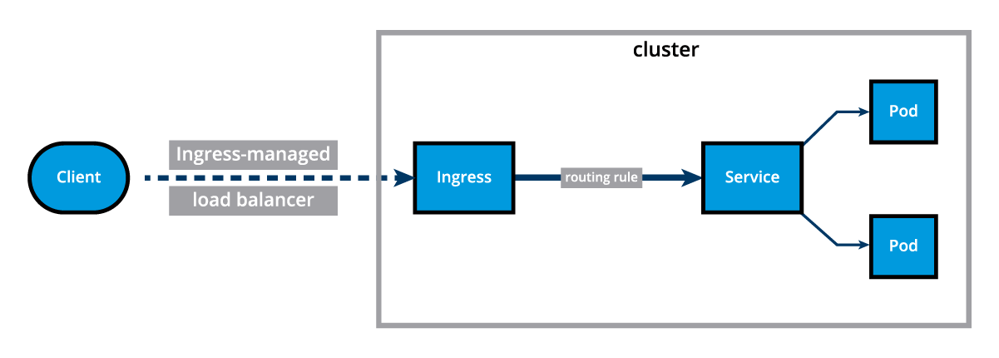
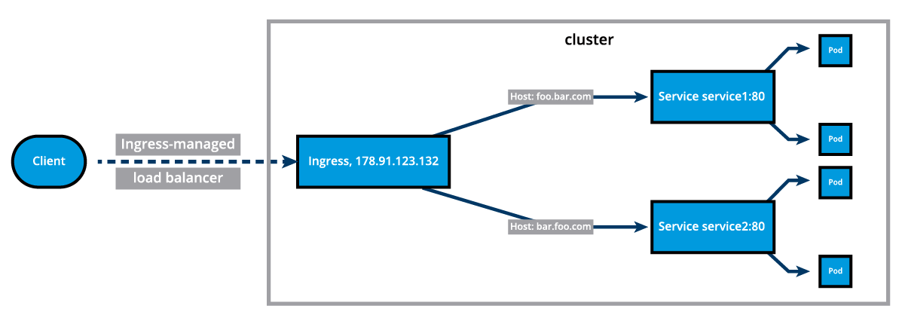
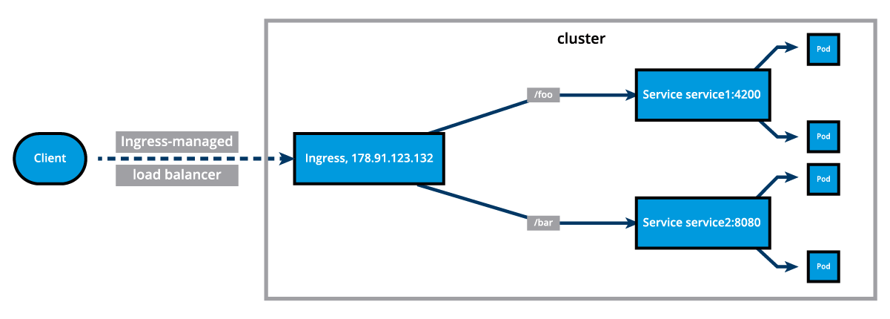

# Ingress

## Chapter Overview

In an earlier chapter, we saw how we can access our deployed containerized application from the external world via *Services*. Among the *ServiceTypes* the `NodePort` and `LoadBalancer` are the most often used. For the `LoadBalancer` *ServiceType*, we need to have support from the underlying infrastructure. Even after having the support, we may not want to use it for every `Service`, as `LoadBalancer` resources are limited and they can increase costs significantly. Managing the `NodePort` *ServiceType* can also be tricky at times, as we need to keep updating our proxy settings and keep track of the assigned ports.

In this chapter, we will explore the `Ingress API` resource, which represents another layer of abstraction, deployed in front of the `Service API `resources, offering a unified method of managing access to our applications from the external world.

## Learning Objectives

By the end of this chapter, you should be able to:

- Explain what `Ingress` and `Ingress Controllers` are.
- Understand when to use `Ingress`.
- Access an application from the external world using `Ingress`.

## Ingress (1)

With Services, routing rules are associated with a given Service. They exist for as long as the Service exists, and there are many rules because there are many Services in the cluster. If we can somehow decouple the routing rules from the application and centralize the rules management, we can then update our application without worrying about its external access. This can be done using the `Ingress` resource - a collection of rules that manage inbound connections to cluster Services.

To allow the inbound connection to reach the cluster Services, Ingress configures a Layer 7 HTTP/HTTPS load balancer for Services and provides the following:

- `TLS (Transport Layer Security)`
- `Name-based virtual hosting`
- `Fanout routing`
- `Loadbalancing`
- `Custom rules`



With Ingress, users do not connect directly to a Service. Users reach the Ingress endpoint, and, from there, the request is forwarded to the desired Service. You can see an example of a [`Name-Based Virtual Hosting`](https://kubernetes.io/docs/concepts/services-networking/ingress/#name-based-virtual-hosting) Ingress definition below:

```yaml
apiVersion: networking.k8s.io/v1
kind: Ingress
metadata:
  annotations:
    nginx.ingress.kubernetes.io/service-upstream: "true"
  name: virtual-host-ingress
  namespace: default
spec:
  ingressClassName: nginx
  rules:
  - host: blue.example.com
    http:
      paths:
      - backend:
          service:
            name: webserver-blue-svc
            port:
              number: 80
        path: /
        pathType: ImplementationSpecific
  - host: green.example.com
    http:
      paths:
      - backend:
          service:
            name: webserver-green-svc
            port:
              number: 80
        path: /
        pathType: ImplementationSpecific
```

In the example above, user requests to both `blue.example.com` and `green.example.com` would go to the same Ingress endpoint, and, from there, they would be forwarded to `webserver-blue-svc`, and `webserver-green-svc`, respectively.

## Ingress (2)

This diagram presents a Name-Based Virtual Hosting Ingress rule:



We can also define [`Fanout`](https://kubernetes.io/docs/concepts/services-networking/ingress/#simple-fanout) Ingress rules, presented in the example definition and the diagram below, when requests to `example.com/blue` and `example.com/green` would be forwarded to `webserver-blue-svc` and `webserver-green-svc`, respectively:

```yaml
apiVersion: networking.k8s.io/v1
kind: Ingress
metadata:
  annotations:
    nginx.ingress.kubernetes.io/service-upstream: "true"
  name: fan-out-ingress
  namespace: default
spec:
  ingressClassName: nginx
  rules:
  - host: example.com
    http:
      paths:
      - path: /blue
        backend:
          service:
            name: webserver-blue-svc
            port:
              number: 80
        pathType: ImplementationSpecific
      - path: /green
        backend:
          service:
            name: webserver-green-svc
            port:
              number: 80
        pathType: ImplementationSpecific
```



The Ingress resource does not do any request forwarding by itself, it merely accepts the definitions of traffic routing rules. The ingress is fulfilled by an Ingress Controller, which is a reverse proxy responsible for traffic routing based on rules defined in the Ingress resource.

## Ingress Controller

An [`Ingress Controller`](https://kubernetes.io/docs/concepts/services-networking/ingress-controllers/) is an application watching the `Control Plane Node's API server` for changes in the Ingress resources and updates the Layer 7 Load Balancer accordingly. An `Ingress Controller` is also known as `Controllers`, `Ingress Proxy`, `Service Proxy`, `Reverse Proxy`, etc. `Kubernetes` supports an array of `Ingress Controllers`, and, if needed, we can also build our own.[ GCE L7 Load Balancer Controller](https://github.com/kubernetes/ingress-gce/blob/master/README.md), [AWS Load Balancer Controller](https://github.com/kubernetes-sigs/aws-load-balancer-controller#readme), and [Nginx Ingress Controller](https://github.com/kubernetes/ingress-nginx/blob/master/README.md) are commonly used Ingress Controllers. Other controllers are [Contour](https://projectcontour.io/), [HAProxy Ingress](https://haproxy-ingress.github.io/), [Istio Ingress](https://istio.io/latest/docs/tasks/traffic-management/ingress/kubernetes-ingress/), [Kong](https://konghq.com/), [Traefik](https://traefik.io/traefik/), etc. In order to ensure that the ingress controller is watching its corresponding ingress resource, the ingress resource definition manifest needs to include an ingress class name, such as `spec.ingressClassName: nginx` and optionally one or several annotations specific to the desired controller, such as `nginx.ingress.kubernetes.io/service-upstream: "true"` (for an nginx ingress controller).

Starting the Ingress Controller in Minikube is extremely simple. Minikube ships with the [Nginx Ingress Controller](https://www.nginx.com/products/nginx/kubernetes-ingress-controller) set up as an add-on, disabled by default. It can be easily enabled by running the following command:

```bash
$ minikube addons enable ingress
```

## Deploy an Ingress Resource

Once the Ingress Controller is deployed, we can create an Ingress resource using the `kubectl create` command. For example, if we create a `virtual-host-ingress.yaml` file with the Name-Based Virtual Hosting Ingress rule definition that we saw in the Ingress (2) section, then we use the following command to create an Ingress resource:

```bash
$ kubectl create -f virtual-host-ingress.yaml
```

## Access Services Using Ingress

With the Ingress resource we just created, we should now be able to access the `webserver-blue-svc` or `webserver-green-svc` services using the `blue.example.com` and `green.example.com` URLs. As our current setup is on Minikube, we will need to update the host configuration file (`/etc/hosts` on Mac and Linux) on our workstation to the Minikube IP for those URLs. Do not remove any existing entries from `/etc/hosts`, only add the Minikube IP and the two host entries for blue and green services respectively. After the update, the file should look similar to:

```bash
$ sudo vim /etc/hosts
```

Example `/etc/hosts` content:

```
127.0.0.1       localhost
::1             localhost
192.168.99.100  blue.example.com green.example.com
```

Now we can open `blue.example.com` and `green.example.com` on the browser and access each application.